```mermaid
graph TD
    A[FP Primitives] --> B[Semantic Layer]
    B --> C[Clean Package Code]

    D[Universal Protocols] --> E[ssh/curl/git]
    E --> F[Query Actual State]

    C --> G[State Sync Engine]
    F --> G

    G --> H[Infrastructure Orchestration]

    style A fill:#2d5016
    style H fill:#1a3a0f
```

## THE COMPLETE PICTURE

1. **FP discipline** - reliable, composable bash
2. **Semantic layer** - code that reads like English
3. **State sync** - query/compare/apply, no stored state

**Combined with universal protocols:**
- ssh (hosts)
- curl (APIs)
- git (code)

**Result: Infrastructure orchestration that:**
- Works everywhere
- Is readable
- Is reliable
- Has no dependencies
- Doesn't store state

## The Stack

```
┌─────────────────────────────────────────┐
│  Package Code (Clean as Fuck)           │  ← What you write
│  - homelab_host_add()                   │
│  - infra_sync()                         │
│  - require_valid_hostname()             │
│  Reads like: "require valid hostname"   │
└─────────────────────────────────────────┘
              ↓
┌─────────────────────────────────────────┐
│  Semantic Utilities                     │  ← Translation layer
│  - parse_option()                       │
│  - fail_with()                          │
│  - inform_user()                        │
│  Hides: FP machinery                    │
└─────────────────────────────────────────┘
              ↓
┌─────────────────────────────────────────┐
│  FP Infrastructure                      │  ← Functional core
│  - utils_stream_map()                   │
│  - validate_require()                   │
│  - utils_stream_bind()                  │
│  Guarantees: Composition works          │
└─────────────────────────────────────────┘
              ↓
┌─────────────────────────────────────────┐
│  Universal Protocols                    │  ← Platform layer
│  - ssh (query hosts)                    │
│  - curl (query APIs)                    │
│  - git (query repos)                    │
│  Works: Everywhere                      │
└─────────────────────────────────────────┘
              ↓
┌─────────────────────────────────────────┐
│  State Sync Engine                      │  ← The insight
│  - Query actual state                   │
│  - Compare to desired                   │
│  - Apply diff                           │
│  No stored state                        │
└─────────────────────────────────────────┘
```

## What This Enables

### Example: Complete Infrastructure Workflow

```bash
#!/usr/bin/env bash
# deploy.sh - Deploy complete infrastructure

set -Eeuo pipefail

# 1. Sync cloud infrastructure
inform_user "creating cloud resources"
ish infra sync --config=configs/cloud.conf

# Output:
# creating cloud resources
# syncing DigitalOcean droplets
#   web01: creating
#   web02: creating
#   db01: ✓ exists
# infrastructure synced

# 2. Wait for instances to be ready
inform_user "waiting for instances"
ish infra wait --config=configs/cloud.conf

# 3. Discover IPs and create host configs
inform_user "discovering hosts"
ish infra discover --config=configs/cloud.conf --output=configs/discovered-hosts.conf

# 4. Bootstrap ish on all hosts
inform_user "bootstrapping hosts"
ish homelab fleet bootstrap --config=configs/discovered-hosts.conf

# 5. Configure hosts
inform_user "configuring hosts"
ish homelab fleet configure --config=configs/discovered-hosts.conf

# 6. Check for drift
inform_user "checking for drift"
ish homelab fleet drift --config=configs/discovered-hosts.conf

# 7. Validate policies
inform_user "validating security policies"
ish homelab fleet policy validate --policy=policies/security.policy

# 8. Deploy application
inform_user "deploying application"
ish infra deploy --config=configs/app.conf

inform_user "deployment complete"
```

No YAML. No HCL. No Python. No Ruby. Just bash that reads like English.

## The Key Insight

### Clean Bash = Three Layers Working Together

**Layer 1: FP Primitives (Hidden)**
```bash
# bash/utils/stream.sh
utils_stream_map() {
  local func="$1"
  local line
  while IFS= read -r line; do
    "$func" "$line"
  done
}
```

**Layer 2: Semantic Wrapper (Interface)**
```bash
# bash/utils/semantic.sh
inform_user() {
  utils_tui_info --message="$1"
}

require_valid_hostname() {
  local hostname="$1"
  validate_require validate_hostname "$hostname" "invalid hostname: $hostname"
}
```

**Layer 3: Package Code (What Users See)**
```bash
# source/host/add.sh
homelab_host_add() {
  local hostname ip
  hostname=$(parse_option "--hostname" "$@")
  ip=$(parse_option "--ip" "$@")

  require_valid_hostname "$hostname"
  require_valid_ip "$ip"

  if host_already_registered "$hostname"; then
    inform_user "host already exists: $hostname"
    return 0
  fi

  inform_user "testing connectivity: $ip"
  require_ssh_works "$ip"

  inform_user "gathering system info"
  os=$(detect_remote_os "$ip")
  arch=$(detect_remote_arch "$ip")

  register_host "$hostname" "$ip" "$os" "$arch"
  inform_user "added host: $hostname ($ip)"
}
```

**This is clean because:**
- Each line is a sentence
- No machinery visible
- Error handling implicit
- Pure functions hidden in utilities
- Reads top to bottom
- No surprises

## The Complete System

### What You've Built

```
ish-homelab/
├── Host Management
│   ├── Add/remove hosts
│   ├── Inspect state
│   ├── Bootstrap ish
│   └── List/query hosts
│
├── Configuration Management
│   ├── Declarative configs
│   ├── Idempotent application
│   ├── Drift detection
│   └── Fleet operations
│
├── Policy Enforcement
│   ├── Validate policies
│   ├── Enforce policies
│   ├── Compliance reporting
│   └── Fleet policy checks
│
└── Infrastructure Orchestration
    ├── Cloud resource management (curl)
    ├── Host configuration (ssh)
    ├── Code deployment (git)
    └── State sync (no stored state)
```

**All in clean, functional bash.**

## The Comparison

### Terraform

```hcl
# Verbose HCL
resource "digitalocean_droplet" "web" {
  count  = 2
  name   = "web-${count.index + 1}"
  size   = "s-1vcpu-1gb"
  image  = "ubuntu-24-04-x64"
  region = "nyc3"
}

# State management hell
terraform {
  backend "s3" {
    bucket = "state"
    key    = "terraform.tfstate"

    dynamodb_table = "locks"
  }
}

# Error handling
Error: Error locking state
Error: State drift detected
Error: Backend configuration changed
```

### ish

```bash
# Readable bash
digitalocean_droplets=(
  web01:s-1vcpu-1gb:nyc3
  web02:s-1vcpu-1gb:nyc3
)

# No state management
ish infra sync --config=configs/cloud.conf

# Error handling
# (just works - fails fast with clear messages)
```

## The Files You Need

### Core Utilities (Build Once)

```
bash/utils/
├── stream.sh           # FP primitives (map/bind/filter/fold)
├── validate.sh         # Validators + combinators
├── compose.sh          # Function composition
├── semantic.sh         # Semantic wrappers
├── tui.sh              # Terminal UI
└── exists.sh           # Existence checks
```

### Homelab Package (Your First Package)

```
packages/ish-homelab/
├── source/
│   ├── host/
│   │   ├── add.sh              # Add host
│   │   ├── list.sh             # List hosts
│   │   ├── inspect.sh          # Inspect state
│   │   ├── configure.sh        # Apply config
│   │   └── drift.sh            # Check drift
│   ├── fleet/
│   │   ├── drift.sh            # Fleet drift
│   │   └── configure.sh        # Fleet configure
│   ├── storage/
│   │   ├── hosts_file.sh       # Host registry
│   │   ├── config.sh           # Config loading
│   │   └── parse.sh            # Parsing
│   └── remote/
│       ├── connectivity.sh     # SSH checks
│       ├── execute.sh          # Remote commands
│       └── copy.sh             # File transfer
├── configs/
│   ├── lab01.conf
│   └── defaults.conf
└── policies/
    └── security.policy
```

### Infrastructure Package (The Big One)

```
packages/ish-infra/
├── source/
│   ├── cloud/
│   │   ├── provider.sh         # Abstract provider
│   │   ├── digitalocean.sh     # DO implementation
│   │   ├── aws.sh              # AWS implementation
│   │   └── gcp.sh              # GCP implementation
│   ├── infra/
│   │   ├── sync.sh             # Sync infrastructure
│   │   ├── drift.sh            # Check drift
│   │   └── query.sh            # Query state
│   └── compose/
│       ├── create.sh           # Create + configure
│       └── deploy.sh           # Full deployment
├── configs/
│   ├── cloud.conf
│   └── infrastructure.conf
└── docs/
    └── README.md
```

## The Development Flow

### 1. Write Test (Spec)

```bash
# test/unit/host/add.bats
@test "add requires valid hostname" {
  run homelab_host_add --hostname="" --ip="192.168.1.10"
  assert_failure
  assert_output --partial "invalid hostname"
}
```

### 2. Write Semantic Code

```bash
# source/host/add.sh
homelab_host_add() {
  hostname=$(parse_option "--hostname" "$@")
  require_valid_hostname "$hostname"
  # ...
}
```

### 3. Test Passes

```bash
$ ./ish self test
✓ add requires valid hostname
```

### 4. Code is Clean

Because:
- FP primitives guarantee composition
- Semantic layer hides machinery
- Pure functions testable in isolation
- Error handling centralized
- Reads like English

## The Killer Feature Matrix

| Feature | Terraform | Ansible | ish |
|---------|-----------|---------|-----|
| **State Management** | Complex (S3/locks) | None | None (query actual) |
| **Dependencies** | Go runtime + providers | Python + modules | bash + ssh + curl + git |
| **Learning Curve** | HCL + concepts | YAML + Jinja2 | Just bash (but clean) |
| **Drift Detection** | Manual refresh | No built-in | Automatic (query vs desired) |
| **Multi-cloud** | Yes (via providers) | Yes (via modules) | Yes (via curl) |
| **Host Config** | Limited | Yes | Yes |
| **Policy as Code** | Sentinel (Enterprise) | No | Built-in |
| **Readability** | Medium | Low (YAML soup) | High (English-like) |
| **Lock Conflicts** | Yes | No | No |
| **State Drift** | Yes | N/A | No (always query) |
| **Works Offline** | No (needs state) | Mostly | Yes (local configs) |
