```mermaid
graph TD
    A[SSH for Hosts] --> B[Direct State Query]
    C[curl for Cloud APIs] --> B
    D[git for Repos] --> B

    B --> E[Universal State Sync]
    E --> F[No Stored State]
    F --> G[Just Query + Diff + Apply]

    style E fill:#2d5016
    style G fill:#1a3a0f
```

**Every infrastructure system has an API. APIs are just HTTP. curl is universal.**

## The Complete Picture

### The Three Primitives

```bash
# 1. SSH - for direct host access
ssh host 'systemctl list-units'

# 2. curl - for cloud APIs
curl -H "Authorization: Bearer $TOKEN" https://api.digitalocean.com/v2/droplets

# 3. git - for code/config repositories
git ls-remote https://github.com/user/repo
```

**These three tools exist everywhere. They're the universal adapters.**

## Cloud Infrastructure via curl

### Digital Ocean Example

```bash
# source/cloud/digitalocean.sh

# Query actual state (no stored state)
query_droplets() {
  curl -s -H "Authorization: Bearer $DO_TOKEN" \
    "https://api.digitalocean.com/v2/droplets" | \
    jq -r '.droplets[] | "\(.name):\(.id):\(.status):\(.networks.v4[0].ip_address)"'
}

# Desired state (just a config file)
# configs/cloud.conf
droplets=(
  web01:s-1vcpu-1gb:nyc3
  web02:s-1vcpu-1gb:nyc3
  db01:s-2vcpu-4gb:nyc3
)

# Sync state
sync_droplets() {
  local config="$1"

  # Query actual
  actual=$(query_droplets)

  # Load desired
  desired=$(load_desired_droplets "$config")

  # Calculate diff
  missing=$(find_missing_droplets "$desired" "$actual")
  extra=$(find_extra_droplets "$desired" "$actual")

  # Apply changes
  create_droplets "$missing"
  destroy_droplets "$extra"
}

# Create is just curl POST
create_droplet() {
  local name="$1" size="$2" region="$3"

  curl -X POST "https://api.digitalocean.com/v2/droplets" \
    -H "Authorization: Bearer $DO_TOKEN" \
    -H "Content-Type: application/json" \
    -d "{
      \"name\": \"$name\",
      \"size\": \"$size\",
      \"region\": \"$region\",
      \"image\": \"ubuntu-24-04-x64\"
    }" | jq -r '.droplet.id'
}

# Destroy is just curl DELETE
destroy_droplet() {
  local droplet_id="$1"

  curl -X DELETE \
    "https://api.digitalocean.com/v2/droplets/$droplet_id" \
    -H "Authorization: Bearer $DO_TOKEN"
}
```

### AWS Example

```bash
# source/cloud/aws.sh

# Query EC2 instances (actual state)
query_instances() {
  # AWS CLI is just curl with signing
  # But we can call it directly or use curl with AWS sig v4

  aws ec2 describe-instances \
    --query 'Reservations[].Instances[].[InstanceId,State.Name,Tags[?Key==`Name`].Value|[0]]' \
    --output text
}

# Or raw curl with AWS signature
query_instances_raw() {
  # AWS signature v4 signing (can be done in pure bash)
  local signature=$(aws_sign_request "ec2.us-east-1.amazonaws.com" "DescribeInstances")

  curl -s "https://ec2.us-east-1.amazonaws.com/" \
    -H "Authorization: $signature" \
    -d "Action=DescribeInstances&Version=2016-11-15"
}

# Create instance
create_instance() {
  local name="$1" type="$2" ami="$3"

  aws ec2 run-instances \
    --image-id "$ami" \
    --instance-type "$type" \
    --tag-specifications "ResourceType=instance,Tags=[{Key=Name,Value=$name}]" \
    --query 'Instances[0].InstanceId' \
    --output text
}
```

### Google Cloud Example

```bash
# source/cloud/gcp.sh

# Query GCE instances
query_gce_instances() {
  local project="$1"
  local token=$(gcloud auth print-access-token)

  curl -s -H "Authorization: Bearer $token" \
    "https://compute.googleapis.com/compute/v1/projects/$project/zones/us-central1-a/instances" | \
    jq -r '.items[] | "\(.name):\(.id):\(.status)"'
}

# Create instance
create_gce_instance() {
  local project="$1" name="$2" type="$3"
  local token=$(gcloud auth print-access-token)

  curl -X POST \
    "https://compute.googleapis.com/compute/v1/projects/$project/zones/us-central1-a/instances" \
    -H "Authorization: Bearer $token" \
    -H "Content-Type: application/json" \
    -d "{
      \"name\": \"$name\",
      \"machineType\": \"zones/us-central1-a/machineTypes/$type\",
      \"disks\": [{
        \"boot\": true,
        \"initializeParams\": {
          \"sourceImage\": \"projects/ubuntu-os-cloud/global/images/family/ubuntu-2404-lts-amd64\"
        }
      }],
      \"networkInterfaces\": [{
        \"network\": \"global/networks/default\"
      }]
    }"
}
```

## The Universal Pattern

### Query Actual State

```bash
# Host via SSH
query_host_state() {
  local ip="$1"
  ssh "$ip" 'dpkg -l; systemctl list-units'
}

# Cloud via curl
query_cloud_state() {
  curl -H "Authorization: Bearer $TOKEN" "$API_ENDPOINT"
}

# Git repo state
query_repo_state() {
  git ls-remote "$REPO_URL"
}

# Container state
query_container_state() {
  curl --unix-socket /var/run/docker.sock http://localhost/containers/json
}

# Kubernetes state
query_k8s_state() {
  local token=$(cat /var/run/secrets/kubernetes.io/serviceaccount/token)
  curl -H "Authorization: Bearer $token" \
    "https://kubernetes.default.svc/api/v1/pods"
}
```

### The Abstraction

```bash
# source/state/query.sh

# Generic query interface
query_state() {
  local type="$1"
  shift

  case "$type" in
    host)
      query_host_state "$@"
      ;;
    digitalocean)
      query_do_state "$@"
      ;;
    aws)
      query_aws_state "$@"
      ;;
    gcp)
      query_gcp_state "$@"
      ;;
    docker)
      query_docker_state "$@"
      ;;
    k8s)
      query_k8s_state "$@"
      ;;
    *)
      fail_with "unknown state type: $type"
      ;;
  esac
}

# Generic sync interface
sync_state() {
  local type="$1"
  local config="$2"

  actual=$(query_state "$type" "$config")
  desired=$(load_desired_state "$config")

  diff=$(compare_states "$desired" "$actual")
  apply_changes "$type" "$diff"
}
```

## The Config Format (Universal)

```bash
# configs/infrastructure.conf

# Hosts (via SSH)
hosts=(
  lab01:192.168.1.10:ubuntu
  lab02:192.168.1.11:ubuntu
)

# Cloud instances (via curl)
digitalocean_droplets=(
  web01:s-1vcpu-1gb:nyc3
  web02:s-1vcpu-1gb:nyc3
)

aws_instances=(
  db01:t3.medium:us-east-1a:ami-12345
  db02:t3.medium:us-east-1b:ami-12345
)

# Containers (via Docker API)
containers=(
  nginx:nginx:latest:80:80
  redis:redis:7:6379:6379
)

# Git repos (via git)
repos=(
  /opt/app:https://github.com/user/app.git:main
  /opt/config:https://github.com/user/config.git:v1.2.3
)
```

## The Complete CLI

```bash
# Query any infrastructure
ish infra query --type=digitalocean
ish infra query --type=aws
ish infra query --type=host --hostname=lab01

# Sync any infrastructure
ish infra sync --config=configs/infrastructure.conf

# Drift detection works everywhere
ish infra drift --config=configs/infrastructure.conf

# Output:
# Hosts:
#   lab01: ✓ no drift
#   lab02: ⚠ missing package: postgresql
#
# DigitalOcean:
#   web01: ✓ exists
#   web02: - missing droplet
#
# AWS:
#   db01: ✓ running
#   db02: + extra instance (unexpected)
```

## The Power: Cloud + Host Composition

```bash
# Create infrastructure top-down

# 1. Create cloud instances
ish infra sync --config=configs/cloud.conf
# creates: web01, web02, db01 (via curl to DO/AWS/GCP)

# 2. Wait for them to be ready
ish infra wait --config=configs/cloud.conf
# polls until all instances report running

# 3. Get their IPs and register as hosts
ish infra discover --config=configs/cloud.conf --output=configs/hosts.conf
# queries cloud APIs (curl)
# writes hosts.conf with IPs

# 4. Configure the hosts
ish homelab fleet configure --config=configs/hosts.conf
# bootstraps ish via SSH
# applies configuration via SSH

# 5. Deploy application
ish infra deploy --config=configs/app.conf
# uses SSH to hosts to deploy containers/services
```

## The Implementation

### `source/cloud/provider.sh` - Abstract Provider

```bash
#!/usr/bin/env bash

# Provider interface
provider_query() {
  local provider="$1"
  shift

  case "$provider" in
    digitalocean)
      provider_do_query "$@"
      ;;
    aws)
      provider_aws_query "$@"
      ;;
    gcp)
      provider_gcp_query "$@"
      ;;
    *)
      fail_with "unknown provider: $provider"
      ;;
  esac
}

provider_create() {
  local provider="$1"
  shift

  case "$provider" in
    digitalocean)
      provider_do_create "$@"
      ;;
    aws)
      provider_aws_create "$@"
      ;;
    gcp)
      provider_gcp_create "$@"
      ;;
  esac
}

provider_destroy() {
  local provider="$1"
  shift

  case "$provider" in
    digitalocean)
      provider_do_destroy "$@"
      ;;
    aws)
      provider_aws_destroy "$@"
      ;;
    gcp)
      provider_gcp_destroy "$@"
      ;;
  esac
}
```

### `source/cloud/digitalocean.sh` - DO Implementation

```bash
#!/usr/bin/env bash

source "${ISH_ROOT}/bash/utils/semantic.sh"

# Query all droplets
provider_do_query() {
  require_env_var "DO_TOKEN"

  curl -s -H "Authorization: Bearer $DO_TOKEN" \
    "https://api.digitalocean.com/v2/droplets" | \
    jq -r '.droplets[] | "\(.name):\(.id):\(.status):\(.networks.v4[0].ip_address)"'
}

# Create droplet
provider_do_create() {
  local name="$1" size="$2" region="$3"

  require_env_var "DO_TOKEN"
  require_valid_hostname "$name"

  inform_user "creating droplet: $name ($size in $region)"

  droplet_id=$(curl -s -X POST \
    "https://api.digitalocean.com/v2/droplets" \
    -H "Authorization: Bearer $DO_TOKEN" \
    -H "Content-Type: application/json" \
    -d "{
      \"name\": \"$name\",
      \"size\": \"$size\",
      \"region\": \"$region\",
      \"image\": \"ubuntu-24-04-x64\",
      \"ssh_keys\": [$(get_do_ssh_keys)]
    }" | jq -r '.droplet.id')

  if [[ -z "$droplet_id" ]]; then
    fail_with "failed to create droplet"
  fi

  inform_user "created droplet: $name (id: $droplet_id)"
  echo "$droplet_id"
}

# Destroy droplet
provider_do_destroy() {
  local droplet_id="$1"

  require_env_var "DO_TOKEN"

  inform_user "destroying droplet: $droplet_id"

  curl -s -X DELETE \
    "https://api.digitalocean.com/v2/droplets/$droplet_id" \
    -H "Authorization: Bearer $DO_TOKEN"

  inform_user "destroyed droplet: $droplet_id"
}

# Wait for droplet to be active
provider_do_wait_active() {
  local droplet_id="$1"

  inform_user "waiting for droplet to be active: $droplet_id"

  while true; do
    status=$(curl -s -H "Authorization: Bearer $DO_TOKEN" \
      "https://api.digitalocean.com/v2/droplets/$droplet_id" | \
      jq -r '.droplet.status')

    if [[ "$status" == "active" ]]; then
      break
    fi

    sleep 5
  done

  inform_user "droplet active: $droplet_id"
}

# Get droplet IP
provider_do_get_ip() {
  local droplet_id="$1"

  curl -s -H "Authorization: Bearer $DO_TOKEN" \
    "https://api.digitalocean.com/v2/droplets/$droplet_id" | \
    jq -r '.droplet.networks.v4[0].ip_address'
}
```

### `source/infra/sync.sh` - Infrastructure Sync

```bash
#!/usr/bin/env bash

source "${ISH_ROOT}/bash/utils/semantic.sh"
source "${ISH_ROOT}/packages/ish-homelab/source/cloud/provider.sh"
source "${ISH_ROOT}/packages/ish-homelab/source/storage/config.sh"

# Sync infrastructure to desired state
infra_sync() {
  local config
  config=$(parse_option "--config" "$@")

  require_file_exists "$config"

  inform_user "syncing infrastructure from: $config"

  # Load config
  source "$config"

  # Sync each provider
  if [[ -n "${digitalocean_droplets:-}" ]]; then
    sync_digitalocean_droplets
  fi

  if [[ -n "${aws_instances:-}" ]]; then
    sync_aws_instances
  fi

  if [[ -n "${gcp_instances:-}" ]]; then
    sync_gcp_instances
  fi

  inform_user "infrastructure synced"
}

# Sync DigitalOcean droplets
sync_digitalocean_droplets() {
  inform_user "syncing DigitalOcean droplets"

  # Query actual state
  actual=$(provider_do_query)

  # Compare desired vs actual
  for droplet_spec in "${digitalocean_droplets[@]}"; do
    IFS=: read -r name size region <<< "$droplet_spec"

    if echo "$actual" | grep -q "^${name}:"; then
      inform_user "  $name: ✓ exists"
    else
      inform_user "  $name: creating"
      provider_do_create "$name" "$size" "$region"
    fi
  done

  # Check for extra droplets
  while IFS=: read -r name id status ip; do
    found=false
    for droplet_spec in "${digitalocean_droplets[@]}"; do
      if [[ "$droplet_spec" == "$name:"* ]]; then
        found=true
        break
      fi
    done

    if [[ "$found" == "false" ]]; then
      warn_user "  $name: extra droplet (not in config)"
    fi
  done <<< "$actual"
}
```

## The Dependency Chain

```
bash (universal)
  ├── ssh (for hosts)
  ├── curl (for cloud APIs)
  └── git (for repos)
```

**That's it. Three dependencies. All universal.**

Compare to:
- Terraform: Go runtime + providers
- Ansible: Python + modules + dependencies
- Puppet: Ruby + gems + agents
- Chef: Ruby + gems + agents

## The Files

```
packages/ish-infra/
├── source/
│   ├── cloud/
│   │   ├── provider.sh          # Abstract provider interface
│   │   ├── digitalocean.sh      # DO via curl
│   │   ├── aws.sh               # AWS via curl (or aws cli)
│   │   ├── gcp.sh               # GCP via curl
│   │   ├── hetzner.sh           # Hetzner via curl
│   │   └── linode.sh            # Linode via curl
│   ├── infra/
│   │   ├── query.sh             # Query infrastructure
│   │   ├── sync.sh              # Sync to desired state
│   │   ├── drift.sh             # Check drift
│   │   └── destroy.sh           # Tear down
│   └── compose/
│       ├── create.sh            # Create cloud + configure hosts
│       ├── deploy.sh            # Deploy applications
│       └── orchestrate.sh       # Full workflows
├── configs/
│   ├── cloud.conf               # Cloud resources
│   └── infrastructure.conf      # Everything together
└── docs/
    └── README.md
```

## The Revelation

**Infrastructure orchestration is just:**
1. **Query state** (ssh/curl/git)
2. **Compare to desired** (text files)
3. **Apply diff** (ssh/curl/git)

No stored state. No complex abstractions. Just universal protocols.

This is what Sauron should be. **A state sync engine over universal protocols.**
