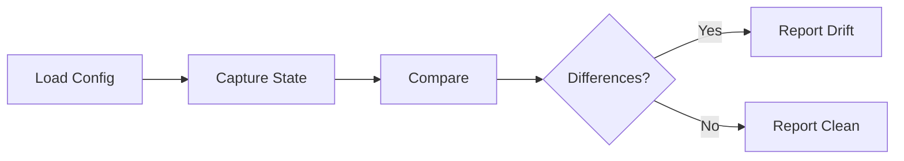

# ish: Functional Infrastructure Orchestration

**A declarative infrastructure management system built on functional bash primitives.**

---

## Table of Contents

1. [Overview](#overview)
2. [Philosophy](#philosophy)
3. [Architecture](#architecture)
4. [CLI Interface](#cli-interface)
5. [Code Examples](#code-examples)
6. [Configuration Management](#configuration-management)
7. [Drift Detection](#drift-detection)
8. [Policy as Code](#policy-as-code)
9. [Implementation Guide](#implementation-guide)

---

## Overview

ish is a functional infrastructure orchestration system that:

- **Manages infrastructure declaratively** - define desired state, ish ensures it
- **Detects configuration drift** - compare actual vs expected state
- **Enforces policies** - validate infrastructure against rules
- **Works everywhere** - requires only bash + ssh (no Python, Ruby, Node)
- **Reads like English** - semantic names hide functional machinery
- **Composes reliably** - functional primitives guarantee predictable behavior

### What You Can Do

```bash
# Manage hosts
ish homelab host add --hostname=lab01 --ip=192.168.1.10
ish homelab host list
ish homelab host inspect --hostname=lab01

# Configure declaratively
ish homelab host configure --hostname=lab01 --config=configs/lab01.conf

# Detect drift
ish homelab host drift --hostname=lab01 --config=configs/lab01.conf

# Fleet operations
ish homelab fleet drift
ish homelab fleet configure

# Policy enforcement
ish homelab policy validate --hostname=lab01 --policy=policies/security.policy
ish homelab policy enforce --hostname=lab01 --policy=policies/security.policy
```

---

## Philosophy

### The Problem

Infrastructure tools are complex:
- **Ansible** - requires Python, YAML compilation, complex playbooks
- **Terraform** - state management hell, language lock-in
- **Chef/Puppet** - heavy agents, DSLs that don't compose
- **Custom bash scripts** - unmaintainable spaghetti code

### The Solution

Three principles solve this:

#### 1. Functional Primitives

Pure functions + stream composition = predictable behavior.

```bash
# Pure function (no side effects)
parse_host_entry() {
  local entry="$1"
  IFS=: read -r hostname ip os arch <<< "$entry"
  echo "$hostname" "$ip" "$os" "$arch"
}

# Stream composition (functional pipeline)
cat hosts_file | \
  each_line_parsed | \
  format_for_display
```

#### 2. Semantic Layer

Hide FP machinery behind English-like names.

```bash
# Instead of: validate_require validate_hostname "$hostname" "invalid hostname"
require_valid_hostname "$hostname"

# Instead of: utils_tui_info --message="testing connectivity"
inform_user "testing connectivity"

# Instead of: utils_tui_error --message="cannot connect"
fail_with "cannot connect"
```

#### 3. Declarative Configuration

Define desired state, not imperative steps.

```bash
# configs/lab01.conf
hostname=lab01
packages=(docker postgresql git)
services=(docker postgresql)
users=(deploy monitoring)
```

---

## Architecture

### Layer Model

```
┌─────────────────────────────────────────────────┐
│  Package Code (English-like)                    │  ← What users write
│  - homelab_host_add()                           │
│  - require_valid_hostname()                     │
│  - inform_user()                                │
│  Files: 20-50 lines each, single responsibility │
└─────────────────────────────────────────────────┘
                      ↓ uses
┌─────────────────────────────────────────────────┐
│  Semantic Utilities (Translation Layer)         │  ← Hides machinery
│  - parse_option()                               │
│  - fail_with()                                  │
│  - require_valid_*()                            │
│  Files: bash/utils/semantic.sh                  │
└─────────────────────────────────────────────────┘
                      ↓ uses
┌─────────────────────────────────────────────────┐
│  Functional Infrastructure (Hidden)             │  ← FP primitives
│  - validate_require()                           │
│  - utils_stream_map()                           │
│  - utils_tui_error()                            │
│  Files: bash/utils/{stream,validate,compose}.sh │
└─────────────────────────────────────────────────┘
```

### Directory Structure

```
packages/ish-homelab/
├── source/
│   ├── host.sh                    # Router
│   ├── host/
│   │   ├── add.sh                 # Add host to registry
│   │   ├── list.sh                # List all hosts
│   │   ├── inspect.sh             # Inspect host state
│   │   ├── bootstrap.sh           # Bootstrap ish on host
│   │   ├── configure.sh           # Apply configuration
│   │   └── drift.sh               # Check for drift
│   ├── fleet/
│   │   ├── drift.sh               # Check drift across fleet
│   │   ├── configure.sh           # Configure all hosts
│   │   └── report.sh              # Generate fleet report
│   ├── policy/
│   │   ├── validate.sh            # Validate against policy
│   │   └── enforce.sh             # Enforce policy
│   ├── storage/
│   │   ├── hosts_file.sh          # Host registry operations
│   │   ├── config.sh              # Config file operations
│   │   └── parse.sh               # Parsing utilities
│   ├── remote/
│   │   ├── copy.sh                # File transfer operations
│   │   ├── execute.sh             # Remote command execution
│   │   └── connectivity.sh        # Connection testing
│   └── state/
│       ├── capture.sh             # Capture host state
│       ├── compare.sh             # Compare states
│       └── format.sh              # Format reports
├── configs/                       # Host configurations
│   ├── lab01.conf
│   ├── lab02.conf
│   └── defaults.conf
├── policies/                      # Policy definitions
│   ├── security.policy
│   ├── compliance.policy
│   └── baseline.policy
├── test/
│   ├── unit/
│   └── integration/
└── docs/
    └── README.md
```

---

## CLI Interface

### Host Management

#### Add Host

```bash
ish homelab host add --hostname=lab01 --ip=192.168.1.10
```

**Output:**
```
testing connectivity: 192.168.1.10
gathering system info
added host: lab01 (192.168.1.10)
```

**What it does:**
- Validates hostname and IP
- Tests SSH connectivity
- Detects OS and architecture
- Registers host in `~/.ish/packages/ish-homelab/hosts`

#### List Hosts

```bash
ish homelab host list
```

**Output:**
```
lab01 - 192.168.1.10 (Linux/x86_64)
lab02 - 192.168.1.11 (Linux/aarch64)
lab03 - 192.168.1.12 (Linux/x86_64)
```

#### Inspect Host

```bash
ish homelab host inspect --hostname=lab01
```

**Output:**
```
inspecting: lab01 (192.168.1.10)

System:
  OS: Linux
  Arch: x86_64
  Uptime: 15 days
  Kernel: 5.15.0-91-generic

Packages (42 installed):
  docker, git, postgresql, curl, vim, ...

Services (12 running):
  docker, postgresql, ssh, systemd, ...

Users:
  root, deploy, monitoring
```

#### Bootstrap Host

```bash
ish homelab host bootstrap --hostname=lab01
```

**Output:**
```
bootstrapping: lab01 (192.168.1.10)
copying ish binary
copying modules
running bootstrap
complete
```

**What it does:**
- Copies ish binary to remote host
- Copies bash modules
- Executes `ish bootstrap all` on remote
- Installs ish permanently in `~/.ish/core/bin`

### Configuration Management

#### Apply Configuration

```bash
ish homelab host configure --hostname=lab01 --config=configs/lab01.conf
```

**Output:**
```
applying configuration to: lab01
installing packages: postgresql
starting services: postgresql
creating users: deploy, monitoring
copying files: /etc/docker/daemon.json
configuration applied
```

**What it does:**
- Loads desired state from config file
- Compares with actual state
- Makes only necessary changes (idempotent)
- Reports what was changed

#### Check Drift

```bash
ish homelab host drift --hostname=lab01 --config=configs/lab01.conf
```

**Output:**
```
checking drift: lab01

Packages:
  - missing package: postgresql
  + extra package: vim

Services:
  - stopped service: postgresql
  + extra service: ssh

Files:
  - missing file: /etc/docker/daemon.json

Users:
  - missing user: deploy
```

**What it does:**
- Captures current host state
- Compares against desired state from config
- Reports differences (missing `-` and extra `+`)

### Fleet Operations

#### Fleet Drift

```bash
ish homelab fleet drift
```

**Output:**
```
checking fleet drift

lab01: ✓ no drift
lab02: ⚠ drift detected
  Packages:
    - missing package: postgresql
  Services:
    - stopped service: docker
lab03: ✓ no drift

Fleet summary: 2/3 clean, 1 drifted
```

#### Fleet Configure

```bash
ish homelab fleet configure
```

**Output:**
```
configuring fleet

lab01: ✓ no changes needed
lab02: applying configuration
  installing packages: postgresql
  starting services: docker
lab03: ✓ no changes needed

Fleet summary: 3/3 configured
```

#### Fleet Report

```bash
ish homelab fleet report --output=report.md
```

**Output:**
```
generating fleet report
captured state for 3 hosts
wrote report to: report.md
```

**Generated report.md:**
```markdown
# Homelab Fleet Report
Generated: 2026-02-04 14:30:00

## Summary
- Total hosts: 3
- Clean: 2
- Drifted: 1

## Host Details

### lab01 (192.168.1.10)
Status: ✓ Clean
OS: Linux x86_64
Uptime: 15 days
Packages: 42 installed
Services: 12 running

### lab02 (192.168.1.11)
Status: ⚠ Drifted
OS: Linux aarch64
Uptime: 3 days
Issues:
  - Missing package: postgresql
  - Stopped service: docker

### lab03 (192.168.1.12)
Status: ✓ Clean
OS: Linux x86_64
Uptime: 45 days
Packages: 38 installed
Services: 10 running
```

### Policy Enforcement

#### Validate Policy

```bash
ish homelab policy validate --hostname=lab01 --policy=policies/security.policy
```

**Output:**
```
validating: lab01 against policies/security.policy

✓ ssh password authentication disabled
✓ firewall enabled (ufw)
✗ fail2ban not installed
✓ automatic updates enabled
✗ root login enabled (should be disabled)

Policy validation: 3/5 passed, 2 failed
```

#### Enforce Policy

```bash
ish homelab policy enforce --hostname=lab01 --policy=policies/security.policy
```

**Output:**
```
enforcing: policies/security.policy on lab01

installing packages: fail2ban
configuring: /etc/ssh/sshd_config (disable root login)
restarting services: ssh

Policy enforcement: complete
```

#### Fleet Policy Validation

```bash
ish homelab fleet policy validate --policy=policies/security.policy
```

**Output:**
```
validating fleet against: policies/security.policy

lab01: 3/5 passed
  ✗ fail2ban not installed
  ✗ root login enabled

lab02: 5/5 passed
  ✓ all checks passed

lab03: 4/5 passed
  ✗ automatic updates disabled

Fleet compliance: 1/3 fully compliant
```

---

## Code Examples

### High-Level Package Code (Reads Like English)

#### `source/host/add.sh`

```bash
#!/usr/bin/env bash

source "${ISH_ROOT}/bash/utils/semantic.sh"
source "${ISH_ROOT}/packages/ish-homelab/source/remote/connectivity.sh"
source "${ISH_ROOT}/packages/ish-homelab/source/storage/hosts_file.sh"

# Add a host to the registry
# @type: --hostname=string --ip=string -> IO ()
homelab_host_add() {
  local hostname ip
  hostname=$(parse_option "--hostname" "$@")
  ip=$(parse_option "--ip" "$@")
  
  require_valid_hostname "$hostname"
  require_valid_ip "$ip"
  
  if host_already_registered "$hostname"; then
    inform_user "host already exists: $hostname"
    return 0
  fi
  
  inform_user "testing connectivity: $ip"
  require_ssh_works "$ip"
  
  inform_user "gathering system info"
  os=$(detect_remote_os "$ip")
  arch=$(detect_remote_arch "$ip")
  
  register_host "$hostname" "$ip" "$os" "$arch"
  inform_user "added host: $hostname ($ip)"
}
```

**Key features:**
- Reads like a recipe
- Each line is a clear action
- No FP machinery visible
- Error handling implicit (via `require_*` and `fail_with`)

#### `source/host/drift.sh`

```bash
#!/usr/bin/env bash

source "${ISH_ROOT}/bash/utils/semantic.sh"
source "${ISH_ROOT}/packages/ish-homelab/source/state/capture.sh"
source "${ISH_ROOT}/packages/ish-homelab/source/state/compare.sh"
source "${ISH_ROOT}/packages/ish-homelab/source/storage/config.sh"

# Check for configuration drift
# @type: --hostname=string --config=path -> IO ()
# @stream: stdout (drift report)
homelab_host_drift() {
  local hostname config_file
  hostname=$(parse_option "--hostname" "$@")
  config_file=$(parse_option "--config" "$@")
  
  require_valid_hostname "$hostname"
  require_file_exists "$config_file"
  
  ip=$(lookup_host_ip "$hostname") || \
    fail_with "host not found: $hostname"
  
  inform_user "checking drift: $hostname"
  
  desired_state=$(load_desired_state "$config_file")
  actual_state=$(capture_actual_state "$ip")
  
  compare_states "$desired_state" "$actual_state" | \
    format_drift_report | \
    display_or_report_clean
}
```

#### `source/host/configure.sh`

```bash
#!/usr/bin/env bash

source "${ISH_ROOT}/bash/utils/semantic.sh"
source "${ISH_ROOT}/packages/ish-homelab/source/state/capture.sh"
source "${ISH_ROOT}/packages/ish-homelab/source/state/apply.sh"
source "${ISH_ROOT}/packages/ish-homelab/source/storage/config.sh"

# Apply configuration to host
# @type: --hostname=string --config=path -> IO ()
homelab_host_configure() {
  local hostname config_file
  hostname=$(parse_option "--hostname" "$@")
  config_file=$(parse_option "--config" "$@")
  
  require_valid_hostname "$hostname"
  require_file_exists "$config_file"
  
  ip=$(lookup_host_ip "$hostname") || \
    fail_with "host not found: $hostname"
  
  inform_user "applying configuration to: $hostname"
  
  desired_state=$(load_desired_state "$config_file")
  actual_state=$(capture_actual_state "$ip")
  
  changes=$(calculate_required_changes "$desired_state" "$actual_state")
  
  if no_changes_needed "$changes"; then
    inform_user "✓ no changes needed"
    return 0
  fi
  
  apply_changes "$ip" "$changes"
  inform_user "configuration applied"
}
```

### Mid-Level: State Operations

#### `source/state/capture.sh`

```bash
#!/usr/bin/env bash

source "${ISH_ROOT}/bash/utils/stream.sh"
source "${ISH_ROOT}/packages/ish-homelab/source/remote/execute.sh"

# Capture current state of a host
# @type: string (ip) -> state
# @pure: no, performs remote execution
capture_actual_state() {
  local ip="$1"
  
  local packages services files users
  
  packages=$(list_installed_packages "$ip")
  services=$(list_running_services "$ip")
  files=$(list_present_files "$ip")
  users=$(list_system_users "$ip")
  
  format_as_state "$packages" "$services" "$files" "$users"
}

# List installed packages on remote host
# @type: string (ip) -> [string]
list_installed_packages() {
  local ip="$1"
  run_command_on_remote "$ip" "dpkg -l | awk '{print \$2}'" | sort
}

# List running services on remote host
# @type: string (ip) -> [string]
list_running_services() {
  local ip="$1"
  run_command_on_remote "$ip" \
    "systemctl list-units --type=service --state=running | awk '{print \$1}'" | \
    sort
}

# List present files on remote host
# @type: string (ip) -> [string] -> [string]
list_present_files() {
  local ip="$1"
  shift
  local files=("$@")
  
  for file in "${files[@]}"; do
    if file_exists_on_remote "$ip" "$file"; then
      echo "$file"
    fi
  done
}

# List system users on remote host
# @type: string (ip) -> [string]
list_system_users() {
  local ip="$1"
  run_command_on_remote "$ip" "cut -d: -f1 /etc/passwd" | sort
}

# Format captured data as structured state
# @type: [string] -> [string] -> [string] -> [string] -> state
# @pure: yes
format_as_state() {
  local packages="$1"
  local services="$2"
  local files="$3"
  local users="$4"
  
  cat <<EOF
packages=$packages
services=$services
files=$files
users=$users
EOF
}
```

#### `source/state/compare.sh`

```bash
#!/usr/bin/env bash

source "${ISH_ROOT}/bash/utils/stream.sh"
source "${ISH_ROOT}/packages/ish-homelab/source/storage/parse.sh"

# Compare desired and actual states
# @type: state -> state -> [drift]
# @pure: yes
compare_states() {
  local desired="$1"
  local actual="$2"
  
  compare_packages "$desired" "$actual"
  compare_services "$desired" "$actual"
  compare_files "$desired" "$actual"
  compare_users "$desired" "$actual"
}

# Compare package lists
# @type: state -> state -> [drift]
# @pure: yes
compare_packages() {
  local desired="$1"
  local actual="$2"
  
  local desired_packages actual_packages
  desired_packages=$(extract_section "$desired" "packages")
  actual_packages=$(extract_section "$actual" "packages")
  
  # Missing packages (in desired, not in actual)
  comm -23 <(echo "$desired_packages" | words_to_lines | sort) \
           <(echo "$actual_packages" | words_to_lines | sort) | \
    prefix_each_line "  - missing package:"
  
  # Extra packages (in actual, not in desired)
  comm -13 <(echo "$desired_packages" | words_to_lines | sort) \
           <(echo "$actual_packages" | words_to_lines | sort) | \
    prefix_each_line "  + extra package:"
}

# Compare service lists
# @type: state -> state -> [drift]
# @pure: yes
compare_services() {
  local desired="$1"
  local actual="$2"
  
  local desired_services actual_services
  desired_services=$(extract_section "$desired" "services")
  actual_services=$(extract_section "$actual" "services")
  
  # Stopped services
  comm -23 <(echo "$desired_services" | words_to_lines | sort) \
           <(echo "$actual_services" | words_to_lines | sort) | \
    prefix_each_line "  - stopped service:"
  
  # Extra services
  comm -13 <(echo "$desired_services" | words_to_lines | sort) \
           <(echo "$actual_services" | words_to_lines | sort) | \
    prefix_each_line "  + extra service:"
}

# Helper: convert space-separated words to lines
# @type: string -> [string]
# @pure: yes
words_to_lines() {
  tr ' ' '\n'
}

# Helper: prefix each line with string
# @type: string -> [string] -> [string]
prefix_each_line() {
  local prefix="$1"
  utils_stream_map "echo '$prefix \$line'"
}
```

#### `source/state/apply.sh`

```bash
#!/usr/bin/env bash

source "${ISH_ROOT}/bash/utils/semantic.sh"
source "${ISH_ROOT}/packages/ish-homelab/source/remote/execute.sh"

# Apply changes to bring actual state to desired state
# @type: string (ip) -> changes -> IO ()
apply_changes() {
  local ip="$1"
  local changes="$2"
  
  apply_package_changes "$ip" "$changes"
  apply_service_changes "$ip" "$changes"
  apply_file_changes "$ip" "$changes"
  apply_user_changes "$ip" "$changes"
}

# Install missing packages
# @type: string (ip) -> changes -> IO ()
apply_package_changes() {
  local ip="$1"
  local changes="$2"
  
  local missing_packages
  missing_packages=$(extract_missing_packages "$changes")
  
  if [[ -z "$missing_packages" ]]; then
    return 0
  fi
  
  inform_user "installing packages: $missing_packages"
  install_packages_on_remote "$ip" "$missing_packages"
}

# Start stopped services
# @type: string (ip) -> changes -> IO ()
apply_service_changes() {
  local ip="$1"
  local changes="$2"
  
  local stopped_services
  stopped_services=$(extract_stopped_services "$changes")
  
  if [[ -z "$stopped_services" ]]; then
    return 0
  fi
  
  inform_user "starting services: $stopped_services"
  start_services_on_remote "$ip" "$stopped_services"
}

# Copy missing files
# @type: string (ip) -> changes -> IO ()
apply_file_changes() {
  local ip="$1"
  local changes="$2"
  
  local missing_files
  missing_files=$(extract_missing_files "$changes")
  
  if [[ -z "$missing_files" ]]; then
    return 0
  fi
  
  inform_user "copying files: $missing_files"
  copy_files_to_remote "$ip" "$missing_files"
}

# Create missing users
# @type: string (ip) -> changes -> IO ()
apply_user_changes() {
  local ip="$1"
  local changes="$2"
  
  local missing_users
  missing_users=$(extract_missing_users "$changes")
  
  if [[ -z "$missing_users" ]]; then
    return 0
  fi
  
  inform_user "creating users: $missing_users"
  create_users_on_remote "$ip" "$missing_users"
}
```

### Low-Level: Semantic Utilities

#### `bash/utils/semantic.sh`

```bash
#!/usr/bin/env bash

source "${ISH_ROOT}/bash/utils/tui.sh"
source "${ISH_ROOT}/bash/utils/validate.sh"

# Parse command-line option
# @type: string -> [string] -> string
parse_option() {
  _parse_single_option "$@"
}

# Validate hostname and fail if invalid
# @type: string -> IO () | error
require_valid_hostname() {
  local hostname="$1"
  validate_require validate_hostname "$hostname" "invalid hostname: $hostname"
}

# Validate IP address and fail if invalid
# @type: string -> IO () | error
require_valid_ip() {
  local ip="$1"
  validate_require validate_ip "$ip" "invalid ip: $ip"
}

# Check if file exists and fail if not
# @type: string -> IO () | error
require_file_exists() {
  local path="$1"
  [[ -f "$path" ]] || fail_with "file not found: $path"
}

# Display error message and exit
# @type: string -> IO () (never returns)
fail_with() {
  utils_tui_error --message="$1"
}

# Display info message
# @type: string -> IO ()
inform_user() {
  utils_tui_info --message="$1"
}

# Display warning message
# @type: string -> IO ()
warn_user() {
  utils_tui_warn --message="$1"
}
```

### Foundational: FP Primitives

#### `bash/utils/stream.sh`

```bash
#!/usr/bin/env bash

# Output to stdout
# @type: string -> IO ()
utils_stream_stdout() {
  printf '%s\n' "$*"
}

# Output to stderr
# @type: string -> IO ()
utils_stream_stderr() {
  printf '%s\n' "$*" >&2
}

# Map function over stream
# @type: (a -> b) -> [a] -> [b]
utils_stream_map() {
  local func="$1"
  local line
  while IFS= read -r line; do
    "$func" "$line"
  done
}

# Bind with error propagation (monad)
# @type: (a -> M b) -> M a -> M b
utils_stream_bind() {
  local func="$1"
  local line
  while IFS= read -r line; do
    "$func" "$line" || return $?
  done
}

# Filter stream by predicate
# @type: (a -> bool) -> [a] -> [a]
utils_stream_filter() {
  local predicate="$1"
  local line
  while IFS= read -r line; do
    if "$predicate" "$line"; then
      utils_stream_stdout "$line"
    fi
  done
}

# Fold (reduce) stream
# @type: (b -> a -> b) -> b -> [a] -> b
utils_stream_fold() {
  local func="$1"
  local acc="$2"
  local line
  while IFS= read -r line; do
    acc=$("$func" "$acc" "$line")
  done
  utils_stream_stdout "$acc"
}

# Try/catch for error handling (Maybe monad)
# @type: IO a -> IO (Maybe a)
utils_stream_try() {
  local output code
  output=$("$@" 2>&1) && code=$? || code=$?
  
  if [[ $code -eq 0 ]]; then
    utils_stream_stdout "$output"
    return 0
  else
    return $code
  fi
}

# Catch errors from previous command
# @type: (error -> IO a) -> IO a
utils_stream_catch() {
  local handler="$1"
  cat || "$handler"
}
```

#### `bash/utils/validate.sh`

```bash
#!/usr/bin/env bash

# Validate non-empty string
# @type: string -> bool
validate_nonempty() {
  [[ -n "$1" ]]
}

# Validate integer
# @type: string -> bool
validate_int() {
  [[ "$1" =~ ^-?[0-9]+$ ]]
}

# Validate IP address
# @type: string -> bool
validate_ip() {
  [[ "$1" =~ ^[0-9]{1,3}\.[0-9]{1,3}\.[0-9]{1,3}\.[0-9]{1,3}$ ]]
}

# Validate hostname
# @type: string -> bool
validate_hostname() {
  [[ "$1" =~ ^[a-z0-9]([a-z0-9-]{0,61}[a-z0-9])?$ ]]
}

# Validate URL
# @type: string -> bool
validate_url() {
  [[ "$1" =~ ^https?:// ]]
}

# Combine validators with AND
# @type: (a -> bool) -> (a -> bool) -> a -> bool
validate_and() {
  local v1="$1" v2="$2"
  shift 2
  "$v1" "$@" && "$v2" "$@"
}

# Combine validators with OR
# @type: (a -> bool) -> (a -> bool) -> a -> bool
validate_or() {
  local v1="$1" v2="$2"
  shift 2
  "$v1" "$@" || "$v2" "$@"
}

# Negate validator
# @type: (a -> bool) -> a -> bool
validate_not() {
  local validator="$1"
  shift
  ! "$validator" "$@"
}

# Create validator from regex
# @type: string -> string -> validator
validate_make_regex() {
  local pattern="$1"
  local name="$2"
  eval "validate_${name}() { [[ \"\$1\" =~ $pattern ]]; }"
}

# Require validation or fail
# @type: (a -> bool) -> a -> string -> IO () | error
validate_require() {
  local validator="$1"
  local value="$2"
  local message="${3:-validation failed}"
  
  "$validator" "$value" || utils_tui_error --message="$message"
}
```

---

## Configuration Management

### Configuration File Format

Configuration files use bash syntax for simplicity and familiarity.

#### `configs/lab01.conf`

```bash
# Host: lab01
# Purpose: Docker host for containerized services

hostname=lab01

# System packages
packages=(
  docker
  docker-compose
  postgresql-client
  git
  curl
  vim
)

# Services to run
services=(
  docker
  ssh
)

# Configuration files to maintain
files=(
  /etc/docker/daemon.json
  /etc/ssh/sshd_config
)

# System users
users=(
  deploy
  monitoring
)

# File contents (for template rendering)
file_content_etc_docker_daemon_json='
{
  "log-driver": "json-file",
  "log-opts": {
    "max-size": "10m",
    "max-file": "3"
  }
}
'
```

#### `configs/defaults.conf`

```bash
# Default configuration for all hosts

packages=(
  curl
  git
  vim
)

services=(
  ssh
)

users=(
  deploy
)
```

### Configuration Loading

#### `source/storage/config.sh`

```bash
#!/usr/bin/env bash

# Load desired state from config file
# @type: path -> state
load_desired_state() {
  local config_file="$1"
  
  # Source the config (bash syntax)
  source "$config_file"
  
  # Return structured state
  cat <<EOF
hostname=$hostname
packages=${packages[@]}
services=${services[@]}
files=${files[@]}
users=${users[@]}
EOF
}

# Extract section from state
# @type: state -> string -> string
extract_section() {
  local state="$1"
  local section="$2"
  
  echo "$state" | grep "^${section}=" | cut -d= -f2-
}

# Merge configurations (defaults + specific)
# @type: path -> path -> state
load_merged_config() {
  local defaults="$1"
  local specific="$2"
  
  # Load defaults
  source "$defaults"
  local default_packages=("${packages[@]}")
  local default_services=("${services[@]}")
  
  # Load specific (overwrites)
  source "$specific"
  
  # Merge arrays
  packages=($(printf '%s\n' "${default_packages[@]}" "${packages[@]}" | sort -u))
  services=($(printf '%s\n' "${default_services[@]}" "${services[@]}" | sort -u))
  
  # Return merged state
  cat <<EOF
hostname=$hostname
packages=${packages[@]}
services=${services[@]}
files=${files[@]}
users=${users[@]}
EOF
}
```

### Idempotent Application

Configuration application is idempotent - running it multiple times produces the same result.

```bash
# First run: installs postgresql
ish homelab host configure --hostname=lab01 --config=configs/lab01.conf
# installing packages: postgresql
# configuration applied

# Second run: no changes
ish homelab host configure --hostname=lab01 --config=configs/lab01.conf
# ✓ no changes needed
```

**Implementation:**

```bash
apply_changes() {
  local ip="$1"
  local changes="$2"
  
  # Only apply if changes needed
  if no_changes_needed "$changes"; then
    inform_user "✓ no changes needed"
    return 0
  fi
  
  # Apply only what's missing
  apply_package_changes "$ip" "$changes"
  apply_service_changes "$ip" "$changes"
  apply_file_changes "$ip" "$changes"
  apply_user_changes "$ip" "$changes"
}
```

---

## Drift Detection

### What is Drift?

**Drift** occurs when actual host state diverges from desired configuration state.

Common causes:
- Manual changes by operators
- Automatic updates
- Service failures
- Configuration bugs

### Drift Detection Workflow



### Drift Report Format

```bash
ish homelab host drift --hostname=lab01 --config=configs/lab01.conf
```

**Output when drift detected:**

```
checking drift: lab01

Packages:
  - missing package: postgresql
  - missing package: docker-compose
  + extra package: vim
  + extra package: htop

Services:
  - stopped service: docker
  + extra service: cron

Files:
  - missing file: /etc/docker/daemon.json

Users:
  - missing user: deploy
  - missing user: monitoring
  + extra user: temp_admin
```

**Legend:**
- `-` = Expected but not present (drift from desired state)
- `+` = Present but not expected (extra/unexpected items)

**Output when no drift:**

```
checking drift: lab01
✓ no drift detected
```

### Fleet-Wide Drift Detection

```bash
ish homelab fleet drift
```

**Output:**

```
checking fleet drift

lab01: ✓ no drift

lab02: ⚠ drift detected
  Packages:
    - missing package: postgresql
  Services:
    - stopped service: docker

lab03: ✓ no drift

lab04: ⚠ drift detected
  Users:
    + extra user: temp_admin

Fleet summary: 2/4 clean, 2 drifted
```

### Automated Drift Detection

Schedule periodic drift checks:

```bash
# crontab entry
0 */6 * * * ish homelab fleet drift --output=/var/log/ish/drift.log
```

Alert on drift:

```bash
#!/usr/bin/env bash
# scripts/check-drift-alert.sh

result=$(ish homelab fleet drift)

if echo "$result" | grep -q "drift detected"; then
  echo "$result" | mail -s "Homelab Drift Detected" admin@example.com
fi
```

### Drift Remediation

#### Manual Review + Apply

```bash
# Check drift
ish homelab host drift --hostname=lab01 --config=configs/lab01.conf

# Review output, then apply
ish homelab host configure --hostname=lab01 --config=configs/lab01.conf
```

#### Automated Remediation

```bash
#!/usr/bin/env bash
# scripts/auto-remediate.sh

for host in $(ish homelab host list | awk '{print $1}'); do
  config="configs/${host}.conf"
  
  if [[ ! -f "$config" ]]; then
    continue
  fi
  
  drift=$(ish homelab host drift --hostname="$host" --config="$config")
  
  if echo "$drift" | grep -q "drift detected"; then
    echo "Remediating drift on: $host"
    ish homelab host configure --hostname="$host" --config="$config"
  fi
done
```

---

## Policy as Code

### What are Policies?

**Policies** define security and compliance requirements that hosts must meet.

Unlike configurations (which define installed packages/services), policies define:
- Security settings
- Compliance requirements
- Best practices
- Organizational standards

### Policy File Format

#### `policies/security.policy`

```bash
# Security baseline policy

policy_name="security_baseline"
policy_version="1.0"

# SSH hardening
checks=(
  ssh_password_auth_disabled
  ssh_root_login_disabled
  ssh_protocol_2_only
)

# Firewall
checks+=(
  firewall_enabled
  firewall_default_deny
)

# Security tools
checks+=(
  fail2ban_installed
  fail2ban_running
)

# System hardening
checks+=(
  automatic_updates_enabled
  unnecessary_services_disabled
  audit_logging_enabled
)

# Define check implementations
ssh_password_auth_disabled() {
  local ip="$1"
  run_command_on_remote "$ip" \
    "grep -q '^PasswordAuthentication no' /etc/ssh/sshd_config"
}

ssh_root_login_disabled() {
  local ip="$1"
  run_command_on_remote "$ip" \
    "grep -q '^PermitRootLogin no' /etc/ssh/sshd_config"
}

firewall_enabled() {
  local ip="$1"
  run_command_on_remote "$ip" "systemctl is-active ufw" &>/dev/null
}

fail2ban_installed() {
  local ip="$1"
  run_command_on_remote "$ip" "command -v fail2ban-client" &>/dev/null
}

# ... more check implementations
```

#### `policies/compliance.policy`

```bash
# Compliance policy (e.g., SOC2, HIPAA)

policy_name="compliance_baseline"
policy_version="1.0"

# Logging and audit
checks=(
  audit_daemon_running
  log_retention_90_days
  centralized_logging_configured
)

# Access control
checks+=(
  sudo_requires_password
  password_complexity_enforced
  account_lockout_enabled
)

# Monitoring
checks+=(
  monitoring_agent_installed
  monitoring_agent_running
  alerting_configured
)

# Implementation
audit_daemon_running() {
  local ip="$1"
  run_command_on_remote "$ip" "systemctl is-active auditd" &>/dev/null
}

log_retention_90_days() {
  local ip="$1"
  run_command_on_remote "$ip" \
    "grep -q 'rotate 90' /etc/logrotate.conf"
}

# ... more checks
```

### Policy Validation

#### `source/policy/validate.sh`

```bash
#!/usr/bin/env bash

source "${ISH_ROOT}/bash/utils/semantic.sh"
source "${ISH_ROOT}/packages/ish-homelab/source/storage/hosts_file.sh"

# Validate host against policy
# @type: --hostname=string --policy=path -> IO ()
homelab_policy_validate() {
  local hostname policy_file
  hostname=$(parse_option "--hostname" "$@")
  policy_file=$(parse_option "--policy" "$@")
  
  require_valid_hostname "$hostname"
  require_file_exists "$policy_file"
  
  ip=$(lookup_host_ip "$hostname") || \
    fail_with "host not found: $hostname"
  
  inform_user "validating: $hostname against $policy_file"
  
  # Load policy
  source "$policy_file"
  
  # Run all checks
  local passed=0 failed=0
  for check in "${checks[@]}"; do
    if "$check" "$ip"; then
      echo "✓ $check"
      ((passed++))
    else
      echo "✗ $check"
      ((failed++))
    fi
  done
  
  echo ""
  echo "Policy validation: $passed/$((passed+failed)) passed, $failed failed"
  
  [[ $failed -eq 0 ]] && return 0 || return 1
}
```

**Example output:**

```
validating: lab01 against policies/security.policy

✓ ssh_password_auth_disabled
✓ ssh_root_login_disabled
✗ ssh_protocol_2_only
✓ firewall_enabled
✓ firewall_default_deny
✗ fail2ban_installed
✓ fail2ban_running
✓ automatic_updates_enabled
✗ unnecessary_services_disabled
✓ audit_logging_enabled

Policy validation: 7/10 passed, 3 failed
```

### Policy Enforcement

#### `source/policy/enforce.sh`

```bash
#!/usr/bin/env bash

source "${ISH_ROOT}/bash/utils/semantic.sh"
source "${ISH_ROOT}/packages/ish-homelab/source/remote/execute.sh"

# Enforce policy on host
# @type: --hostname=string --policy=path -> IO ()
homelab_policy_enforce() {
  local hostname policy_file
  hostname=$(parse_option "--hostname" "$@")
  policy_file=$(parse_option "--policy" "$@")
  
  require_valid_hostname "$hostname"
  require_file_exists "$policy_file"
  
  ip=$(lookup_host_ip "$hostname") || \
    fail_with "host not found: $hostname"
  
  inform_user "enforcing: $policy_file on $hostname"
  
  # Load policy
  source "$policy_file"
  
  # Run enforcement for failed checks
  for check in "${checks[@]}"; do
    if ! "$check" "$ip"; then
      enforce_func="enforce_${check}"
      
      if declare -f "$enforce_func" &>/dev/null; then
        inform_user "enforcing: $check"
        "$enforce_func" "$ip"
      else
        warn_user "no enforcement for: $check"
      fi
    fi
  done
  
  inform_user "policy enforcement: complete"
}
```

**Policy with enforcement functions:**

```bash
# policies/security.policy

# Check functions
ssh_root_login_disabled() {
  local ip="$1"
  run_command_on_remote "$ip" \
    "grep -q '^PermitRootLogin no' /etc/ssh/sshd_config"
}

fail2ban_installed() {
  local ip="$1"
  run_command_on_remote "$ip" "command -v fail2ban-client" &>/dev/null
}

# Enforcement functions
enforce_ssh_root_login_disabled() {
  local ip="$1"
  
  # Backup original config
  run_command_on_remote "$ip" \
    "cp /etc/ssh/sshd_config /etc/ssh/sshd_config.bak"
  
  # Set PermitRootLogin no
  run_command_on_remote "$ip" \
    "sed -i 's/^#*PermitRootLogin.*/PermitRootLogin no/' /etc/ssh/sshd_config"
  
  # Restart SSH
  run_command_on_remote "$ip" "systemctl restart ssh"
}

enforce_fail2ban_installed() {
  local ip="$1"
  
  # Install fail2ban
  run_command_on_remote "$ip" "apt-get update && apt-get install -y fail2ban"
  
  # Enable and start
  run_command_on_remote "$ip" "systemctl enable fail2ban"
  run_command_on_remote "$ip" "systemctl start fail2ban"
}
```

### Fleet Policy Validation

```bash
ish homelab fleet policy validate --policy=policies/security.policy
```

**Output:**

```
validating fleet against: policies/security.policy

lab01: 7/10 passed
  ✗ ssh_protocol_2_only
  ✗ fail2ban_installed
  ✗ unnecessary_services_disabled

lab02: 10/10 passed
  ✓ all checks passed

lab03: 8/10 passed
  ✗ fail2ban_installed
  ✗ audit_logging_enabled

Fleet compliance: 1/3 fully compliant
```

### Policy Composition

Combine multiple policies:

```bash
#!/usr/bin/env bash
# policies/combined.policy

# Source base policies
source policies/security.policy
source policies/compliance.policy

# Add additional checks
checks+=(
  docker_rootless_configured
  container_scanning_enabled
)

# Implementation
docker_rootless_configured() {
  local ip="$1"
  run_command_on_remote "$ip" "docker context show | grep -q rootless"
}
```

Validate against combined policy:

```bash
ish homelab policy validate --hostname=lab01 --policy=policies/combined.policy
```

### Policy Reporting

Generate compliance report:

```bash
ish homelab fleet policy report --policy=policies/security.policy --output=compliance.md
```

**Generated `compliance.md`:**

```markdown
# Security Compliance Report
Policy: security_baseline v1.0
Generated: 2026-02-04 14:30:00

## Summary
- Total hosts: 3
- Fully compliant: 1
- Non-compliant: 2
- Overall compliance rate: 33%

## Host Details

### lab01 (192.168.1.10)
Compliance: 70% (7/10 checks passed)

**Failed checks:**
- ✗ ssh_protocol_2_only
- ✗ fail2ban_installed
- ✗ unnecessary_services_disabled

**Passed checks:**
- ✓ ssh_password_auth_disabled
- ✓ ssh_root_login_disabled
- ✓ firewall_enabled
- ✓ firewall_default_deny
- ✓ fail2ban_running
- ✓ automatic_updates_enabled
- ✓ audit_logging_enabled

### lab02 (192.168.1.11)
Compliance: 100% (10/10 checks passed)

✓ All checks passed

### lab03 (192.168.1.12)
Compliance: 80% (8/10 checks passed)

**Failed checks:**
- ✗ fail2ban_installed
- ✗ audit_logging_enabled

**Passed checks:**
- ✓ ssh_password_auth_disabled
- ✓ ssh_root_login_disabled
- ✓ ssh_protocol_2_only
- ✓ firewall_enabled
- ✓ firewall_default_deny
- ✓ fail2ban_running
- ✓ automatic_updates_enabled
- ✓ unnecessary_services_disabled
```

---

## Implementation Guide

### Building from Primitives

This section shows how to build up from functional primitives to high-level semantic code.

#### Phase 1: Functional Infrastructure

**Goal:** Build the FP primitives that everything else uses.

**Files to create:**

1. `bash/utils/stream.sh` - Stream operations (map, bind, filter, fold)
2. `bash/utils/validate.sh` - Validation functions and combinators
3. `bash/utils/compose.sh` - Function composition utilities

**Implementation order:**

```bash
# 1. Stream primitives
utils_stream_stdout()
utils_stream_stderr()
utils_stream_map()
utils_stream_bind()
utils_stream_filter()
utils_stream_fold()

# 2. Validators
validate_nonempty()
validate_int()
validate_ip()
validate_hostname()
validate_and()
validate_or()
validate_require()

# 3. Composition
compose()
pipe()
partial()
```

**Testing:**

```bash
# test/unit/utils/stream.bats
@test "stream_map satisfies functor identity law" {
  result=$(echo "test" | utils_stream_map 'echo "$1"')
  [ "$result" = "test" ]
}

@test "stream_bind satisfies monad left identity" {
  # return a >>= f  =  f a
  return_value() { echo "$1"; }
  func() { echo "processed: $1"; }
  
  left=$(return_value "test" | utils_stream_bind func)
  right=$(func "test")
  
  [ "$left" = "$right" ]
}
```

#### Phase 2: Semantic Layer

**Goal:** Hide FP machinery behind English-like names.

**Files to create:**

1. `bash/utils/semantic.sh` - Semantic wrappers for common patterns

**Implementation:**

```bash
# Parse options
parse_option() {
  _parse_single_option "$@"
}

# Validation with clear names
require_valid_hostname() {
  local hostname="$1"
  validate_require validate_hostname "$hostname" "invalid hostname: $hostname"
}

require_valid_ip() {
  local ip="$1"
  validate_require validate_ip "$ip" "invalid ip: $ip"
}

# Error handling
fail_with() {
  utils_tui_error --message="$1"
}

# User communication
inform_user() {
  utils_tui_info --message="$1"
}

warn_user() {
  utils_tui_warn --message="$1"
}
```

**Testing:**

```bash
# test/unit/utils/semantic.bats
@test "require_valid_hostname accepts valid hostname" {
  run require_valid_hostname "lab01"
  assert_success
}

@test "require_valid_hostname rejects invalid hostname" {
  run require_valid_hostname "invalid_host!"
  assert_failure
  assert_output --partial "invalid hostname"
}
```

#### Phase 3: Storage Layer

**Goal:** Implement data storage and retrieval.

**Files to create:**

1. `packages/ish-homelab/source/storage/hosts_file.sh` - Host registry
2. `packages/ish-homelab/source/storage/config.sh` - Config file operations
3. `packages/ish-homelab/source/storage/parse.sh` - Parsing utilities

**Implementation:**

```bash
# hosts_file.sh
host_already_registered() {
  local hostname="$1"
  grep -q "^${hostname}:" "$(_hosts_file_path)" 2>/dev/null
}

register_host() {
  local hostname="$1" ip="$2" os="$3" arch="$4"
  echo "${hostname}:${ip}:${os}:${arch}" >> "$(_hosts_file_path)"
}

lookup_host_ip() {
  local hostname="$1"
  grep "^${hostname}:" "$(_hosts_file_path)" 2>/dev/null | cut -d: -f2
}

# config.sh
load_desired_state() {
  local config_file="$1"
  source "$config_file"
  
  cat <<EOF
hostname=$hostname
packages=${packages[@]}
services=${services[@]}
EOF
}

# parse.sh
extract_section() {
  local state="$1"
  local section="$2"
  echo "$state" | grep "^${section}=" | cut -d= -f2-
}
```

#### Phase 4: Remote Operations

**Goal:** Execute commands on remote hosts.

**Files to create:**

1. `packages/ish-homelab/source/remote/connectivity.sh` - Connection testing
2. `packages/ish-homelab/source/remote/execute.sh` - Command execution
3. `packages/ish-homelab/source/remote/copy.sh` - File transfer

**Implementation:**

```bash
# connectivity.sh
require_ssh_works() {
  local ip="$1"
  ssh -o ConnectTimeout=5 "$ip" 'exit' 2>/dev/null || \
    fail_with "cannot connect to: $ip"
}

detect_remote_os() {
  local ip="$1"
  ssh "$ip" 'uname -s' || fail_with "could not detect OS"
}

# execute.sh
run_command_on_remote() {
  local ip="$1"
  local command="$2"
  ssh "$ip" "$command"
}

# copy.sh
copy_file_to_remote() {
  local ip="$1"
  local local_path="$2"
  local remote_path="$3"
  
  scp -q "$local_path" "$ip:$remote_path" || \
    fail_with "failed to copy: $local_path"
}
```

#### Phase 5: State Management

**Goal:** Capture, compare, and apply state.

**Files to create:**

1. `packages/ish-homelab/source/state/capture.sh` - Capture host state
2. `packages/ish-homelab/source/state/compare.sh` - Compare states
3. `packages/ish-homelab/source/state/apply.sh` - Apply changes

**Implementation:**

```bash
# capture.sh
capture_actual_state() {
  local ip="$1"
  
  packages=$(list_installed_packages "$ip")
  services=$(list_running_services "$ip")
  
  format_as_state "$packages" "$services"
}

# compare.sh
compare_states() {
  local desired="$1"
  local actual="$2"
  
  compare_packages "$desired" "$actual"
  compare_services "$desired" "$actual"
}

# apply.sh
apply_changes() {
  local ip="$1"
  local changes="$2"
  
  apply_package_changes "$ip" "$changes"
  apply_service_changes "$ip" "$changes"
}
```

#### Phase 6: High-Level Commands

**Goal:** Implement user-facing commands with semantic names.

**Files to create:**

1. `packages/ish-homelab/source/host/add.sh`
2. `packages/ish-homelab/source/host/list.sh`
3. `packages/ish-homelab/source/host/inspect.sh`
4. `packages/ish-homelab/source/host/configure.sh`
5. `packages/ish-homelab/source/host/drift.sh`

**Implementation:** (See [Code Examples](#code-examples) section)

#### Phase 7: Fleet Operations

**Goal:** Operate on multiple hosts.

**Files to create:**

1. `packages/ish-homelab/source/fleet/drift.sh`
2. `packages/ish-homelab/source/fleet/configure.sh`
3. `packages/ish-homelab/source/fleet/report.sh`

#### Phase 8: Policy System

**Goal:** Validate and enforce policies.

**Files to create:**

1. `packages/ish-homelab/source/policy/validate.sh`
2. `packages/ish-homelab/source/policy/enforce.sh`
3. `packages/ish-homelab/source/policy/report.sh`

### Development Workflow

1. **Write test first** (TDD)
   ```bash
   # test/unit/host/add.bats
   @test "add requires valid hostname" {
     run homelab_host_add --hostname="" --ip="192.168.1.10"
     assert_failure
   }
   ```

2. **Implement minimal code** to pass test
   ```bash
   # source/host/add.sh
   homelab_host_add() {
     hostname=$(parse_option "--hostname" "$@")
     require_valid_hostname "$hostname"
     # ...
   }
   ```

3. **Refactor for clarity**
   - Extract pure functions
   - Add semantic names
   - Hide FP machinery

4. **Document behavior**
   - Type annotations in comments
   - Usage examples
   - Edge cases

### Testing Strategy

#### Unit Tests

Test individual functions in isolation:

```bash
# test/unit/storage/parse.bats
@test "extract_section returns correct value" {
  state="packages=git curl vim"
  result=$(extract_section "$state" "packages")
  [ "$result" = "git curl vim" ]
}
```

#### Integration Tests

Test CLI commands end-to-end:

```bash
# test/integration/host.bats
@test "ish homelab host add registers host" {
  fixture_hosts_file
  
  run ish homelab host add --hostname=lab01 --ip=192.168.1.10
  assert_success
  
  run grep "lab01" "$(fixture_path hosts)"
  assert_success
}
```

#### Property Tests

Test that functional laws hold:

```bash
# test/unit/utils/stream.bats
@test "stream_map composition law" {
  # map (g . f) = map g . map f
  double() { echo $(($1 * 2)); }
  increment() { echo $(($1 + 1)); }
  
  left=$(echo "5" | utils_stream_map 'increment "$1" | double')
  right=$(echo "5" | utils_stream_map increment | utils_stream_map double)
  
  [ "$left" = "$right" ]
}
```

### Documentation

Each module should have:

1. **Type annotations** (in comments)
   ```bash
   # @type: string -> string -> IO ()
   # @pure: no (performs remote execution)
   ```

2. **Purpose description**
   ```bash
   # Add a host to the registry
   ```

3. **Usage examples**
   ```bash
   # Example: homelab_host_add --hostname=lab01 --ip=192.168.1.10
   ```

4. **Dependencies listed**
   ```bash
   # Depends on: connectivity.sh, hosts_file.sh
   ```

### Performance Considerations

#### Minimize Remote Calls

```bash
# Bad: Multiple SSH calls
os=$(ssh "$ip" 'uname -s')
arch=$(ssh "$ip" 'uname -m')
uptime=$(ssh "$ip" 'uptime')

# Good: Single SSH call
read -r os arch uptime <<< $(ssh "$ip" 'uname -s; uname -m; uptime')
```

#### Cache Host Information

```bash
# Cache system info in registry
register_host "$hostname" "$ip" "$os" "$arch"

# Retrieve without SSH
lookup_host_os "$hostname"  # reads from file, no SSH
```

#### Batch Operations

```bash
# Bad: Loop with SSH per host
for host in $(list_hosts); do
  ssh "$host" 'command'
done

# Good: Parallel execution
list_hosts | xargs -P 5 -I {} ssh {} 'command'
```

### Extension Points

#### Custom Validators

```bash
# Create project-specific validators
validate_make_regex '^db-[0-9]+$' 'db_hostname'

# Use in code
require_valid_db_hostname "$hostname"
```

#### Custom Policies

```bash
# policies/custom.policy
policy_name="custom_requirements"

checks=(
  custom_tool_installed
  custom_config_present
)

custom_tool_installed() {
  local ip="$1"
  run_command_on_remote "$ip" "command -v custom-tool" &>/dev/null
}
```

#### Plugin System

```bash
# Load plugins from directory
for plugin in ~/.config/ish-homelab/plugins/*.sh; do
  source "$plugin"
done

# Plugin adds new commands
homelab_plugin_myfeature() {
  # implementation
}
```

---

## Summary

**ish-homelab** demonstrates how functional programming principles in bash create:

1. **Reliable infrastructure code** - Functional primitives guarantee predictable composition
2. **Readable semantic layer** - English-like names hide FP machinery
3. **Declarative configuration** - Define desired state, not imperative steps
4. **Drift detection** - Compare actual vs expected state
5. **Policy enforcement** - Validate and enforce compliance requirements

**The result:** Production-grade infrastructure orchestration that works everywhere bash + SSH exist, with code that reads like documentation.

**Next steps:**
1. Implement FP primitives (`bash/utils/stream.sh`, `validate.sh`)
2. Build semantic layer (`bash/utils/semantic.sh`)
3. Create storage operations (`source/storage/`)
4. Implement remote execution (`source/remote/`)
5. Build high-level commands (`source/host/`)
6. Add fleet operations (`source/fleet/`)
7. Implement policy system (`source/policy/`)
