```mermaid
graph LR
    A[Terraform Problem] --> B[State Management Hell]
    B --> C[Locks, Backends, Conflicts]
    
    D[ish Solution] --> E[No Stored State]
    E --> F[Query Actual State]
    F --> G[Compare to Desired]
    G --> H[Sync Diff]
    
    style D fill:#2d5016
    style H fill:#1a3a0f
    style B fill:#8b0000
```

## Query, Don't Sync

**Terraform's entire complexity comes from trying to STORE state instead of QUERYING it.**

## The Insight

### Terraform's Approach (Wrong)

```
1. Store state in file/S3/Consul
2. Lock state during operations
3. Compare desired config to stored state
4. Apply changes
5. Update stored state
6. Unlock

Problems:
- State drift (stored ≠ actual)
- Lock conflicts
- State file corruption
- Multiple people = state hell
- Manual state manipulation
```

### ish Approach (Right)

```
1. Query actual state from host (SSH)
2. Compare actual to desired config (just text files)
3. Apply diff
4. Done

No stored state. No locks. No backends.
```

## The Code Proves It

### Terraform Way (State Management)

```hcl
# terraform.tfstate (stored state - can drift)
{
  "version": 4,
  "resources": [{
    "type": "aws_instance",
    "instances": [{
      "attributes": {
        "ami": "ami-123",
        "instance_type": "t2.micro"
      }
    }]
  }]
}

# What if someone manually changed the instance?
# State file lies. Now you need:
terraform refresh  # Update state from reality
terraform plan     # Compare state to config
terraform apply    # Maybe fix drift?
```

### ish Way (State Sync)

```bash
# No stored state. Query reality.
actual=$(capture_actual_state "$ip")
desired=$(load_desired_state "configs/lab01.conf")

# Compare
diff=$(compare_states "$desired" "$actual")

# Sync
apply_changes "$ip" "$diff"

# Done. No state file to maintain.
```

## Why This Works

### The Fundamental Difference

**Terraform:** "I'll remember what I created and track changes"
- Stored state is a CACHE
- Caches invalidate
- Cache invalidation is hard

**ish:** "I'll ask the host what it has right now"
- Actual state is the SOURCE OF TRUTH
- No cache to invalidate
- Query is cheap (SSH is fast enough)

## The Complete Picture

### What Terraform Does

```
Config → State File → Reality
         ↑         ↓
         └─ drift ─┘
```

**State file is middleware that can desync.**

### What ish Does

```
Config → Query Reality → Diff → Apply
```

**Reality is always the source of truth.**

## The Implementation

### State Sync Pattern

```bash
# source/state/sync.sh

# Sync state from desired to actual
# @type: string (ip) -> path (config) -> IO ()
sync_state() {
  local ip="$1"
  local config="$2"
  
  # No stored state - query reality
  actual=$(query_actual_state "$ip")
  
  # Load desired
  desired=$(load_desired_state "$config")
  
  # Calculate diff
  diff=$(calculate_diff "$desired" "$actual")
  
  # Apply only the diff
  apply_diff "$ip" "$diff"
  
  # No state to store - we're done
}

# Query actual state (source of truth)
query_actual_state() {
  local ip="$1"
  
  cat <<EOF
packages=$(list_packages "$ip")
services=$(list_services "$ip")
users=$(list_users "$ip")
files=$(list_files "$ip")
EOF
}

# Calculate what needs to change
calculate_diff() {
  local desired="$1"
  local actual="$2"
  
  # Pure function - no state involved
  comm -23 <(parse "$desired") <(parse "$actual")
}

# Apply only the diff
apply_diff() {
  local ip="$1"
  local diff="$2"
  
  # Idempotent - safe to run multiple times
  install_missing_packages "$ip" "$diff"
  start_stopped_services "$ip" "$diff"
  create_missing_users "$ip" "$diff"
}
```

### No Locks Needed

```bash
# Multiple people can run simultaneously
$ ish homelab host configure --hostname=lab01 --config=configs/lab01.conf
# Person A runs this

$ ish homelab host configure --hostname=lab01 --config=configs/lab01.conf
# Person B runs this 5 seconds later

# No lock conflicts!
# Both query actual state
# Both calculate same diff
# Both apply idempotently
# Last one wins (or both succeed if idempotent)
```

### Drift Detection is Free

```bash
# Drift detection is just:
# 1. Query actual
# 2. Compare to desired
# 3. Report diff

homelab_host_drift() {
  local hostname="$1"
  local config="$2"
  
  ip=$(lookup_host_ip "$hostname")
  
  actual=$(query_actual_state "$ip")
  desired=$(load_desired_state "$config")
  
  # Diff IS the drift report
  compare_states "$desired" "$actual"
}
```

## Why Terraform Can't Do This

### Terraform's Constraints

1. **Multi-provider** - Can't query AWS/GCP/Azure uniformly
2. **API rate limits** - Querying is "expensive"
3. **Eventually consistent** - Cloud APIs lie
4. **Complex dependencies** - Need to track resource graph

### ish's Advantages

1. **Single protocol** - SSH works everywhere
2. **Direct access** - Query the actual host
3. **Immediate consistency** - Host knows its state now
4. **Simple dependencies** - Just packages/services/files

## The Philosophical Shift

### From Stored State to Observed State

**Stored state:**
- "I remember creating X"
- "Let me check my notes"
- "My notes might be wrong"
- "I need to lock my notes while I work"

**Observed state:**
- "Let me ask the host what it has"
- "The host is the source of truth"
- "The host can't lie about its current state"
- "No need to lock - query is cheap"

## The Implications

### 1. No State Backends

```bash
# Terraform needs:
terraform {
  backend "s3" {
    bucket = "terraform-state"
    key    = "prod/terraform.tfstate"
    region = "us-east-1"
    
    dynamodb_table = "terraform-locks"
    encrypt        = true
  }
}

# ish needs:
# (nothing - configs are just text files)
```

### 2. No State Commands

```bash
# Terraform has entire subsystem for state:
terraform state list
terraform state show
terraform state mv
terraform state rm
terraform state pull
terraform state push
terraform state replace-provider
terraform refresh

# ish has:
# (nothing - just query the host)
```

### 3. No Lock Conflicts

```bash
# Terraform:
Error: Error locking state: Error acquiring the state lock
State lock dynamo-table already held by another process
Lock Info:
  ID:        12345
  Operation: OperationTypeApply
  Who:       user@hostname
  Created:   2024-01-15 10:30:00

# ish:
# (can't happen - no locks)
```

### 4. No State Drift Issues

```bash
# Terraform:
Warning: Resource targeting is in effect
You are creating a plan with the -target option, which means that the plan may not 
represent the entire state of your infrastructure

# ish:
# (can't happen - always query actual state)
```

## The Trade-offs

### What ish Gives Up

1. **Dependency tracking** - Can't model complex resource graphs
2. **Multi-cloud** - Works for SSH-accessible hosts only
3. **Declarative destroy** - No "terraform destroy" equivalent
4. **Change preview** - Plan vs Apply distinction less clear

### What ish Gains

1. **Simplicity** - No state management complexity
2. **Reliability** - Source of truth is always current
3. **Concurrency** - No locks needed
4. **Transparency** - Just query the host

## The Pattern Generalizes

### Any Infrastructure System Can Use This

```bash
# Instead of storing state about containers:
docker ps  # Query actual state

# Instead of storing state about K8s:
kubectl get pods  # Query actual state

# Instead of storing state about VMs:
ssh "$vm" 'systemctl list-units'  # Query actual state
```

**The pattern:** Make the system queryable, don't store state separately.

## The Complete Workflow

### Terraform Workflow

```
1. Write config
2. terraform init (setup backend)
3. terraform plan (compare config to state file)
4. terraform apply (update reality + state file)
5. terraform refresh (sync state file from reality) ← manual
6. Deal with state drift
7. Deal with lock conflicts
8. Deal with state file corruption
```

### ish Workflow

```
1. Write config
2. ish homelab host configure (query reality, apply diff)
3. Done
```

## The Revelation

**State management is solved by NOT MANAGING STATE.**

Just query it when you need it. Reality is the source of truth. Everything else is complexity for complexity's sake.

This is why ish is fundamentally simpler than Terraform/Ansible/Puppet/Chef - they all try to maintain state, and **state maintenance is the problem, not the solution.**

## The Implications for Ish

**Don't manage state. Sync it.**

```rust
// Not this (Terraform way)
struct State {
    resources: Vec<Resource>,
    lock: Mutex<()>,
    backend: Backend,
}

// This (ish way)
fn sync_state(desired: Config, actual: fn() -> State) -> Result<()> {
    let current = actual();
    let diff = desired.diff(current);
    apply(diff)
}
```

**No state storage. Just queries and diffs.**
