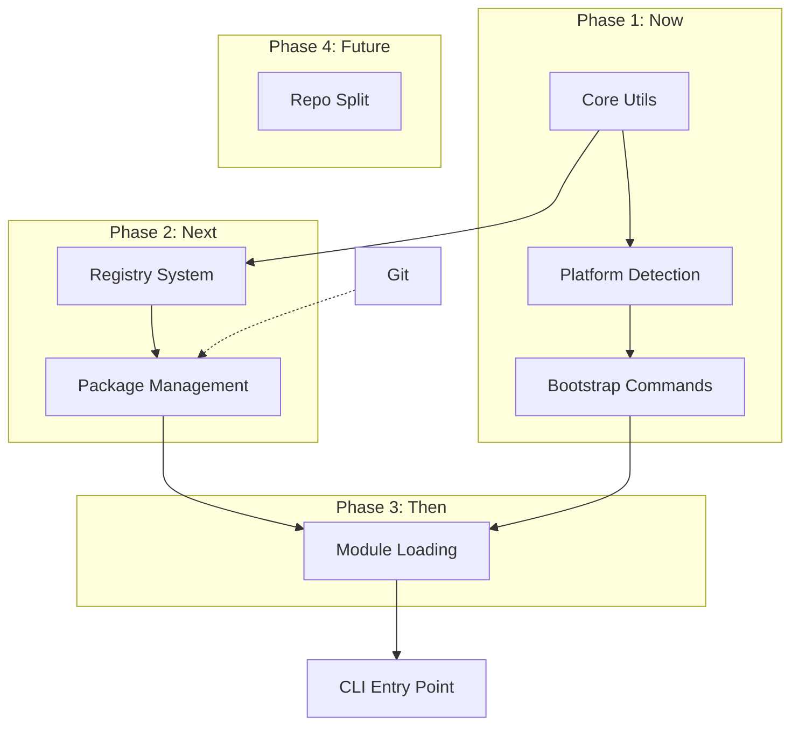

## Migration Path

### Step 1: Restructure Current Repo

**Goal:** Prepare for split without actually splitting

1. Create `packages/ish/` and `packages/dotfiles/` directories
2. Create `packages/ish/bin/` directory
3. Move current `ish` script → `packages/ish/bin/ish`
4. Create symlink at repo root: `ish -> packages/ish/bin/ish` (development convenience)
5. Move `bash/utils/`, `bash/platform.sh` → `packages/ish/source/`
6. Move `bash/kanban/` → `packages/ish/source/kanban/` (kanban is part of ish core)
7. Move `bash/bootstrap/`, `bash/git/`, `bash/nix/` → `packages/dotfiles/source/`
8. Create `packages/ish/source/self/` and `packages/dotfiles/source/self/`
   - Each package gets its own self/ module for test/lint/install
9. Move dotfiles to `packages/dotfiles/data/`:
   - `.bashrc`, `.bash_profile`, `wezterm.lua` → `data/`
   - `neovim/` → `data/neovim/`
10. Split `test/` by package:
    - ish tests → `packages/ish/test/`
    - dotfiles tests → `packages/dotfiles/test/`
11. Split `docs/` by package:
    - ish docs → `packages/ish/docs/`
    - dotfiles docs → `packages/dotfiles/docs/`
    - Keep `architecture.md`, `vision.md` at repo root `docs/`
12. Add namespace prefixes:
    - `ish_*` for ish package functions
    - `dotfiles_*` for dotfiles package functions

**Development structure:**
```
dotfiles/
├── ish -> packages/ish/bin/ish    # Symlink for convenience
├── packages/
│   ├── ish/
│   │   ├── bin/
│   │   │   └── ish                # Real entry point
│   │   ├── source/
│   │   │   ├── utils/
│   │   │   ├── platform.sh
│   │   │   ├── kanban/
│   │   │   └── self/
│   │   ├── test/
│   │   └── docs/
│   └── dotfiles/
│       ├── source/
│       │   ├── bootstrap/
│       │   ├── git/
│       │   ├── nix/
│       │   └── self/
│       ├── test/
│       ├── docs/
│       └── data/
│           ├── .bashrc
│           ├── .bash_profile
│           ├── wezterm.lua
│           └── neovim/
├── kanban/                        # Project management (meta)
├── docs/                          # Repo-level docs
└── README.md
```

**Usage during development:**
```bash
./ish self verify                  # Symlink makes this convenient
./ish self install                 # Copies packages/ish/bin/ish to ~/.local/bin/ish
./ish kanban show                  # Works via symlink
```

### Step 2: Implement GPG Signing Infrastructure

**Prerequisite for `ish self verify`**

1. Set up GPG signing (kanban task: "gpg-signed-commits")
   - Generate/configure GPG key
   - Configure git to sign commits: `git config commit.gpgsign true`
   - Add git hooks to enforce signing (reject unsigned commits)
   - Publish GPG public key fingerprint (website, keybase, etc.)
2. Sign all commits going forward
3. Optionally sign previous commits (rebase with `--gpg-sign`)

### Step 3: Implement Registry & Verification Commands

1. Add `packages/ish/source/registry.sh`
   - Implement `ish_register_add()`
   - Implement `ish_register_remove()`
   - Implement `ish_register_list()`
   - Implement `ish_register_sync()`
2. Add `packages/ish/source/package.sh`
   - Implement `ish_package_list()`
   - Implement `ish_package_install()`
   - Implement `ish_package_update()`
   - Implement `ish_package_remove()`
   - Implement `ish_package_validate()`
3. Update `packages/ish/source/self.sh`
   - Implement `ish_self_verify()` with options:
     - Default: Verify all commits
     - `--head-only`: Verify HEAD only
     - `--depth=N`: Verify last N commits
     - `--since-tag`: Verify since last tag
   - Check git repository integrity
   - Verify commit signatures based on mode
   - Validate package structure
   - Run tests
4. Add routing to `ish` entry point
5. Add tests for registry operations
6. Add tests for package operations
7. Add tests for self verification (requires signed test commits)

### Step 4: Test Locally

**Goal:** Validate package structure works in development environment

1. After restructure (Step 1), test from repo root via symlink:
   ```bash
   ./ish self verify       # Uses symlink → packages/ish/bin/ish
   ./ish kanban show
   ./ish bootstrap macos all
   ```
2. Test installation:
   ```bash
   ./ish self install      # Copies to ~/.local/bin/ish
   ish --version           # Test installed version
   ```
3. Verify all commands work with new structure
4. Run tests from new locations
5. Battle-test with real usage
6. Iterate on structure if needed

**Note:** Packages stay in dotfiles repo for now. Split happens later (Step 5).

### Step 5: Split Repos (Future)

**Goal:** Extract ish to separate repo - should be trivial after Step 1-4

1. Extract `packages/ish/` → new `github/ratmav/ish` repo
   - Already structured correctly from Step 1
   - Already tested from Step 4
   - Copy directory to new repo
2. Keep `packages/dotfiles/` in `github/ratmav/dotfiles` repo
3. Ensure all commits in new ish repo are GPG signed
4. Publish GPG key fingerprint on multiple platforms
5. Update ish repo README with installation instructions:
   ```bash
   # Clone and verify
   git clone https://github.com/ratmav/ish.git
   cd ish
   ./bin/ish self verify   # Verify all commits signed

   # Install globally
   ./bin/ish self install  # Copies to ~/.local/bin/ish

   # Use ish
   ish package install --namespace=github/ratmav/dotfiles
   ```
6. Dotfiles package declares dependency on ish in `source/self/dependencies.sh`
7. Your workflow: clone ish, verify, install, use for dotfiles management
8. Others' workflow: clone ish, verify, install, use for their own packages

---

## Dependency Graph



---
