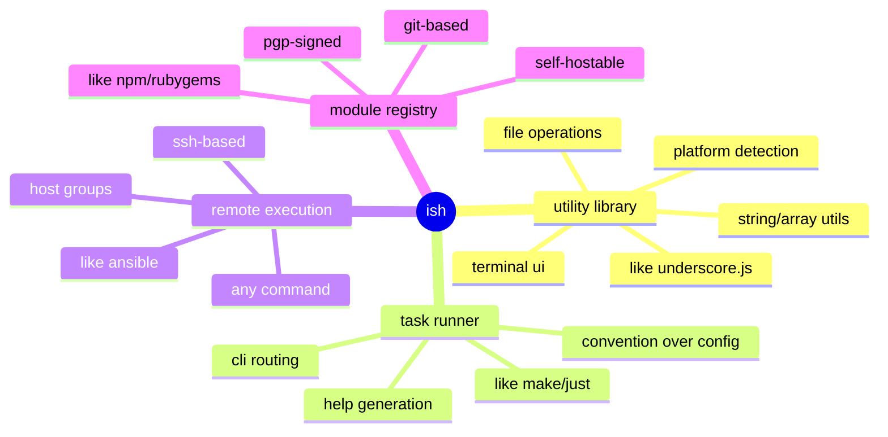

# ish vision: a bash utility library with remote module registry

## executive summary

**ish is underscore.js for bash** - a comprehensive utility library that makes bash scripting productive, with a remote module registry.

```
ish = bash utility library + task runner pattern + remote execution + module registry
      │                      │                    │                  │
      │                      │                    │                  └─ share utilities across projects
      │                      │                    └─ ansible alternative
      │                      └─ make/just pattern
      └─ underscore.js/lodash for bash
```

**not just:**
- a task runner (though it does that)
- an ansible replacement (though it does that)
- a dotfiles manager (though it started there)

**actually:**
- a foundational utility library for bash development
- with conventions for task execution (local and remote)
- with a module registry for sharing utilities across personal projects

**philosophy:** build the best tool for personal use. design by one, not by committee. if others find it useful, cool - but that's not the goal.

## the three layers

```mermaid
graph tb
    subgraph "layer 3: module registry"
        a[ish-docker<br/>docker utilities]
        b[ish-kubernetes<br/>k8s operations]
        c[ish-aws<br/>aws cli helpers]
        d[ish-postgres<br/>db utilities]
        e[community modules...]
    end

    subgraph "layer 2: projects"
        f[ish-dotfiles<br/>personal config]
        g[watkins-infra<br/>infrastructure]
        h[myapp<br/>application tasks]
    end

    subgraph "layer 1: framework/utility library"
        i[core utilities]
        j[tui.sh - terminal ui]
        k[platform.sh - detection]
        l[utils.sh - common ops]
        m[remote.sh - ssh execution]
        n[routing.sh - cli dispatch]
    end

    a --> i
    b --> i
    c --> i
    d --> i
    e --> i

    f --> i
    g --> i
    h --> i

    f -.can use.-> a
    g -.can use.-> b
    h -.can use.-> d
```

### layer 1: core utility library (ish-framework)

the foundation - utility functions every bash project needs:

**terminal ui** (`tui.sh`)
- colored output: `tui_error`, `tui_warn`, `tui_info`, `tui_success`
- user prompts: `tui_confirm`, `tui_select`
- progress indicators
- template rendering

**platform detection** (`platform.sh`)
- os detection: `platform_os` → macos, kali, linux
- architecture detection: `platform_arch` → amd64, arm64
- platform-specific conditionals

**common utilities** (`utils.sh`)
- existence checks: `utils_exists_executable`, `utils_exists_file`
- file operations
- string manipulation
- array operations
- date/time utilities

**remote execution** (`remote.sh`)
- ssh-based command execution
- file transfer
- output streaming
- host groups and parallel execution

**routing system** (`routing.sh`)
- cli argument parsing
- command dispatch
- help text generation
- convention-driven routing

**like underscore.js provides:**
```javascript
_.map([1,2,3], x => x * 2)
_.filter(users, {active: true})
_.debounce(fn, 100)
```

**ish provides:**
```bash
tui_info "processing..."
platform_os  # returns "macos"
utils_exists_executable brew
remote_exec host1,host2 "uptime"
```

these are the primitives. everything builds on these.

### layer 2: projects (ish-project instances)

projects consume the framework and add domain-specific tasks:

**ish-dotfiles** - personal configuration management
- `ish bootstrap macos all` - set up development machine
- `ish git clean prune` - clean local branches
- uses framework utilities + custom bootstrap/git modules

**watkins-infra** - infrastructure provisioning
- `ish provision web all` - provision web servers
- `ish deploy app staging` - deploy to staging
- uses framework utilities + custom provision/deploy modules

**myapp** - application development tasks
- `ish db migrate` - run database migrations
- `ish test integration` - run integration tests
- uses framework utilities + custom db/test modules via `.ishrc`

### layer 3: module registry (shareable extensions)

reusable modules that can be shared across projects:

**example modules:**
- `ish-docker` - docker container management utilities
- `ish-kubernetes` - k8s cluster operations
- `ish-aws` - aws cli wrappers and helpers
- `ish-postgres` - database backup/restore utilities
- `ish-ssl` - certificate generation and management
- `ish-nginx` - nginx configuration helpers

**installation:**
```bash
ish package install ratmav/ish-docker
ish docker container list --format=table
ish docker image prune --all
```

**registry features:**
- git-based distribution (no central package server required)
- pgp-signed registry file (verify authenticity)
- self-hostable (private registries for internal use)
- namespace enforcement (ish-docker → docker_* functions)
- version pinning (projects specify framework + module versions)

## why this matters

### 1. bash is everywhere

every system has bash. not every system has:
- python (ansible)
- ruby (chef)
- node.js (javascript task runners)

bash is the universal runtime. a utility library for bash is universally useful.

### 2. the underscore.js moment for bash

javascript had jquery, then underscore.js/lodash standardized functional utilities. bash has... copied stackoverflow snippets.

ish provides the standard library bash never had:
- consistent error handling
- terminal ui conventions
- platform abstraction
- remote execution patterns
- cli routing patterns

### 3. better than language-specific task runners

**current landscape:**
- ruby projects use rake
- javascript projects use npm scripts or gulp
- go projects use makefiles
- python projects use invoke or fabric

**problem:** every language has its own task runner. infrastructure scripts get rewritten in each language.

**ish approach:** one task runner for all projects, in the universal runtime (bash).

```bash
# works in ruby project
cd ~/myrubyapp && ish test all

# works in go project
cd ~/mygoapp && ish test all

# works on remote infrastructure
ish --remote=prod bootstrap all
```

### 4. module registry for reusability

**the problem:**
- bash utilities scattered across projects
- copy-paste between repos
- "where did i put that script?"

**ish module registry:**
- `ish package search ssl` - find ssl utilities
- `ish package install ratmav/ish-ssl` - one command install
- share utilities across personal projects
- version pinning for stability

## comparison to existing tools

### vs. make/just/task (task runners)

**similarity:** convention-driven task execution

**ish advantage:**
- built-in utility library (tui, platform detection, etc.)
- remote execution: `ish --remote=host <any command>`
- module registry for sharing tasks
- self-contained (no dependencies beyond bash)

### vs. ansible (infrastructure automation)

**similarity:** remote execution, idempotent operations

**ish advantage:**
- no python dependency
- no yaml configuration
- same commands work locally and remotely
- use in any project (web apps, infrastructure, dotfiles)
- lighter weight (single bash script, not framework + modules)

### vs. basher/bpkg (bash package managers)

**similarity:** package installation for bash scripts

**ish advantage:**
- integrated task runner (not just package manager)
- built-in utility library (not just installer)
- remote execution capabilities
- convention-driven architecture (not just script collection)
- signed registry (verify authenticity)

### vs. oh-my-zsh/bash-it (shell frameworks)

**similarity:** extend shell capabilities

**ish difference:**
- not shell-specific (works in any script, not just interactive shells)
- task runner focus (automation, not just shell enhancement)
- project-local (`.ishrc` per project, not global shell config)
- remote execution (run on other machines, not just localhost)

## the positioning



**tagline options:**
- "underscore.js for bash" (positioning against known quantity)
- "the bash utility library with a module registry" (feature-focused)
- "convention-driven infrastructure automation" (current philosophy.md)
- "bash development toolkit" (straightforward)

**elevator pitch:**
> ish is a utility library for bash that makes scripting productive. it provides the standard library bash never had - terminal ui, platform detection, file operations, remote execution - plus a convention-driven task runner and module registry. think underscore.js for bash, with npm-style packages and ansible-style remote execution.

## evolution path

### current state (phase 1-2)
- battle-tested monolith (ish-dotfiles)
- core utilities proven in production
- patterns established

### near-term (phase 3)
- remote execution via `--remote` flag
- per-project tasks via `.ishrc`
- battle-test in multiple projects
- prove framework boundaries

### medium-term (phase 4)
- extract ish-framework (utility library)
- split projects to consume framework
- publish framework as standalone tool

### long-term (phase 5-6)
- module registry goes live
- community publishes extensions
- ecosystem growth
- ish becomes standard bash development toolkit

## success metrics

**framework stability:**
- 3+ personal projects using ish-framework
- utility library stable (no breaking changes for 6+ months)
- documentation complete (every utility function documented)

**module registry:**
- personal modules working across projects
- self-hosted registry operational
- signed package verification working
- version pinning proven in production

**technical validation:**
- zero-dependency installation (bash + ssh only)
- works on fresh systems (bootstrap from nothing)
- remote execution proven in production
- test coverage >80%

**convention enforcement:**
- custom static analysis encodes architectural constraints
- catches violations before runtime (e.g., module_dir collisions)
- conventions become machine-checkable, not just documented

## convention enforcement through static analysis

**the problem:** conventions documented in docs/conventions.md are only enforced through code review and runtime failures. bugs from convention violations (like module_dir variable collisions) slip through and break tests.

**the solution:** custom static analysis rules that encode architectural constraints as checkable rules.

**custom checks to implement:**

1. **module_dir namespacing**
   - detect bare `module_dir=` declarations (should be namespaced like `tui_module_dir=`)
   - prevent variable collisions when modules source each other
   - real bug caught: tui.sh defining module_dir clobbered bootstrap/posix.sh's value

2. **dag validation**
   - analyze source statements to build dependency graph
   - detect circular dependencies
   - enforce unidirectional flow (only source peers or children, never parents)
   - validate directory structure matches dependency flow

3. **function naming conventions**
   - verify functions match file path (bash/foo/bar.sh → foo_bar_* functions)
   - detect functions in wrong files
   - enforce prefix consistency within modules

4. **explicit routing pattern**
   - ensure routable modules have *_route() functions
   - verify routes dispatch to functions, not inline code
   - check public functions are registered in routing

5. **sourcing patterns**
   - validate script_dir and *_module_dir initialization
   - ensure source statements use absolute paths via script_dir
   - prevent brittle relative path sourcing

**implementation path:**

**shellcheck custom rules status** (ref: https://github.com/koalaman/shellcheck/issues/1061)
- shellcheck does not currently support plugin/extension system
- custom rules require changes to shellcheck engine itself (haskell)
- community has requested this feature, not yet implemented
- **decision: fork shellcheck or build standalone analyzer**

**alternatives if shellcheck doesn't support plugins:**
- standalone bash script analyzer (parse bash ast, apply rules)
- grep-based checks (fragile but better than nothing)
- wrapper around shellcheck + custom post-processing
- fork shellcheck and maintain ish-specific fork

**implementation strategy:**
```bash
# phase 1: investigate shellcheck extensibility
# - read shellcheck docs/source
# - determine plugin architecture (if any)
# - prototype one custom rule (module_dir check)

# phase 2: build or fork
# - if pluggable: write custom rules in shellcheck's dsl
# - if not pluggable: fork shellcheck or build standalone analyzer

# phase 3: integrate into ish self lint
ish self lint all  # runs shellcheck + custom rules
```

**benefits:**
- **catch bugs early** - violations detected at lint time, not test/runtime
- **self-documenting** - rules encode the "why" behind conventions
- **refactoring confidence** - static validation makes changes safer
- **convention evolution** - guidelines become guarantees

**precedent:**
- eslint (custom rules via plugins)
- rubocop (custom cops in ruby)
- go vet (custom analyzers)

**timeline:** post-milestone 4 (long-term). high effort but high value - architectural guarantees prevent entire classes of bugs.

**long-term vision:** ish-framework ships with static analysis (forked shellcheck or standalone) that enforces dag architecture. conventions are provably correct, not aspirational. the maintenance cost of a fork is acceptable for architectural guarantees that prevent bugs like module_dir collisions from ever happening.

## strategic choices

### why not python?

**advantages of python:**
- rich standard library
- package ecosystem (pypi)
- ansible already exists

**advantages of bash:**
- **universal runtime** - every system has bash
- **self-contained** - no interpreter to install
- **lightweight** - single file, instant execution
- **bootstrap-friendly** - can install everything else (including python)
- **native system integration** - shell commands are first-class

**decision:** bash is the right choice for infrastructure automation and system bootstrapping. python is better for application logic. use the right tool for each layer.

### why not just use functions in .bashrc?

**that works for:**
- personal shell customization
- interactive convenience functions
- one-off helpers

**ish provides:**
- **structure** - convention-driven organization
- **portability** - works in any project, any machine
- **remote execution** - run on other systems
- **sharing** - module registry for reusable components
- **testing** - bats integration, fixture patterns
- **documentation** - help text generation, conventions

functions in .bashrc are personal notes. ish is a shared library.

### why self-hosted registry vs. central service?

**self-hosted advantages:**
- **security** - you control what code you trust
- **privacy** - internal modules stay internal
- **reliability** - no dependency on external service
- **simplicity** - registry is just a signed json/yaml file

**central service advantages:**
- easier discovery (browse packages)
- social features (stars, downloads, etc.)

**decision:** self-hosted registry with optional central index. like debian repos (distributed) not pypi (centralized). pgp signatures provide trust without centralization.

## design constraints

from claude.md and philosophy.md:

1. **live off the land** - minimal dependencies, maximum portability
2. **convention over configuration** - patterns, not yaml
3. **let abstractions emerge** - wait for 2+ instances before extracting
4. **production parity** - test on real systems with real constraints
5. **brevity** - minimum hierarchy levels needed
6. **fail fast** - errors are fatal, warnings continue
7. **self-contained** - copy one file, it works
8. **remote-ready** - same commands work locally or over ssh

these constraints shape every decision. the utility library must be:
- portable (works on any posix system)
- lightweight (single file distribution possible)
- testable (deterministic, no external dependencies)
- discoverable (help text at every level)

## open questions

**framework distribution:**
- git submodule (current plan)
- curl | bash one-liner (for bootstrap)
- package manager (brew install ish-framework)
- all of the above?

**version management:**
- how do projects pin framework versions?
- semantic versioning for framework releases?
- breaking changes policy?

**module namespace:**
- enforce package naming (ish-docker, ish-aws)?
- allow any name with namespace enforcement (foo → foo_*)?
- handle collisions (two modules want same name)?

**registry trust model:**
- pgp web of trust?
- single authority signature?
- per-organization signing keys?

**backward compatibility:**
- how long to support old framework versions?
- deprecation policy for utilities?
- migration tools for breaking changes?

these questions get answered during phase 3-4 battle-testing.

## call to action

**current focus:** phase 1-2 (complete core, stabilize)

**next steps:**
1. document all utility functions (api reference)
2. implement `--remote` flag (prove ansible replacement)
3. battle-test in 2+ non-dotfiles projects (prove framework boundary)
4. design module registry (prove sharing model)

**long-term goal:** build the best personal infrastructure toolkit - a utility library that makes bash productive, a task runner that works everywhere, a module registry that eliminates copy-paste across projects.

**success looks like:** reaching for ish first when automating infrastructure, confident it will handle the job cleanly.

---

*this vision builds on years of battle-tested code and proven patterns. it's not speculative - the utility library already exists in the current monolith. the task is extraction and formalization, not invention.*
